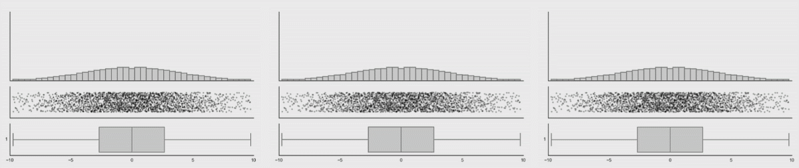

```{r setup, include=FALSE}
library(iblir)
knitr::opts_chunk$set(echo = FALSE)
```

```{r, context="data", include=FALSE}

Calf<-readRDS("./www/Calf.Rda")

```


## Introduction

In this lab you will learn how to do a two-sample *t* test and visualize the differences between samples with violin plots in R. 

## Two-sample *t* test {data-progressive=TRUE}

The two-sample *t* test is used to compare the mean of two independent samples. Unlike the paired *t* test the data for a two sample *t* test cannot be matched in any way. The groups must be independent. Samples are independent if each one is drawn without reference to the other, and has no connection with the other. Independent samples are obtained by either sampling from two distinct populations (one sample from Athens, Ga and the other is from Athens, Greece) or by randomizing a single sample into different groups. In either case the sample data are independent of each other. 

Why do we use two-sample *t* tests? The goal is to estimate the difference in the means ($\mu_{1}-\mu_{2}$) and to see if the difference is statistically significant or due to chance. 


### Study Description

Farmers who raise beef cattle get paid by the pound. In the past antibiotics and hormones were used to increase weight gain, but a growing number of consumers now want antibiotic and hormone free beef products. As a result farms now need to figure out which feed will lead to the best weight gain in calves without the use of antibiotics and hormones. 

So an experiment was set up. 200 calves were randomized to receive 1 of 4 feeds for 3 weeks. The feeds are distinguished by the amount of protein (low and high) and the source of protein (rice and corn). At the end of the 3 week period the calves weight was compared to their weight at the start of the study and their total weight gain in pounds was recorded. 

### Exercise 1: Data and Assumption Check

There are two assumptions we need to check before using a the 2-sample *t* test. 

1. The samples are independent
2. The data is normally distributed
3. The population variances are equal 


**Data Dictionary**
Feed: This variable indicates the type of feed the calf received ("Corn_LowP", "Corn_HighP", "Rice_LowP", "Rice_HighP").
Weight_Gain: The total weight the calf gained in pounds during the study period.   


**Instructions** Review the data and variable distributions. Answer the quiz questions.

```{r, context="render", echo=FALSE}

fluidPage(
  wellPanel(
    fluidRow(
      column(
        6,
        selectInput('var', label = "Select Feed type to Summarize", 
                     choices = list("Corn_LowP", "Corn_HighP", "Rice_LowP", "Rice_HighP"), 
                     selected = "Corn_LowP")
        )
      )
    ),
  fluidRow(
    column(
      6, 
      h4(strong("Plot of Weight Gain for Selected Feed")),
      plotOutput(outputId = 'plot', width = "100%")
      ),
    column(
      6,
      h4(strong("Data")),
      DT::dataTableOutput('rawdata')
      )
    ),
  fluidRow(
    column(
      12,
      h4(strong("Summary of Weight Gain for Selected Feed")),
      verbatimTextOutput("summary")
      )
    )
  )


```

```{r, context="server"}

#Basic plot of the selected variable
  output$plot <- renderPlot({
    
    validate(need(!is.null(input$var), 'Please select a variable to show the plot.'))
    
      x <- Calf[Calf$Feed==input$var, "Weight_Gain"]
      bins <- round((max(x)-min(x))/(3.5*(sd(x)/length(Calf[Calf$Feed==input$var, "Weight_Gain"])^(1/3))),0)
  
    hist(Calf[Calf$Feed==input$var, "Weight_Gain"],
      breaks = bins,
      main = paste(input$var),
      xlab = paste("Weight_Gain"))
    
    
  })

  # show raw data
  output$rawdata <- DT::renderDataTable({
    Calf2<-Calf 
    Calf2$Weight_Gain<-round(Calf2$Weight_Gain,2)
    DT::datatable(Calf2, options = list(lengthMenu = c(5, 30, 50), pageLength = 10)) 
  })
  
  
  # show a summary of the selected variable
  output$summary <- renderPrint({
    
    validate(need(!is.null(input$var), 'Please select a variable to show the summary.'))
    
    x <- Calf[Calf$Feed==input$var, "Weight_Gain"]
    summary(x)
    })
  
```


### Quiz: Questions 1-2

```{r Q1-2}
quiz(
  question("Are the calf samples independent?",
    answer("Yes, they were from different farms"),
    answer("Yes, each group got a different feed"),
    answer("Yes, they were randomized into 4 independent groups", correct = TRUE),
    answer("No, they were from the same farm"),
  allow_retry = TRUE
  ),
  question("Which feed has the lowest mean weight gain?",
    answer("Corn_LowP", correct = TRUE),
    answer("Rice_HighP"),
    answer("Corn_HighP"),
    answer("Rice_LowP"),
  allow_retry = TRUE
  )
)
```

### Exercise 2: Corn Feed (High Protein vs Low Protein)

Now that you have a feel for the data and have check the assumptions for the two sample *t* test we can start testing different hypothesis. We will use the same [t.test()](https://www.rdocumentation.org/packages/stats/versions/3.6.0/topics/t.test) function we used in labs 10 and 11. Two get conduct a two sample *t* test using this function you will follow this general form **t.test(outcome ~ group, , data = "dataset", alternative= type, var.equal=FALSE)**. First you specify the "outcome" and "group" variables separated by a "**~**". The "**outcome ~ group**" expression tells R you want to know the difference in the outcome between the two groups. Next you tell the function the name of the data set that contains the variables. The "type" is the same as before (two sided, less than, greater than). Final setting "var.equal=FALSE" lets R know you do not want to assume the variances are equal between the samples (FALSE has to be in all capital letters or it will not work), if you did want to assume equal variances you would replace the FLASE with TRUE.

It is important to note that the "group" variable has to be a factor with only 2 levels. Right now our grouping variable (Feed) has 4. So before we can do the test we have to select a subset of our data with observations for the two groups we want to compare.


Perform a two sample t-test of the null hypothesis that there is not a difference in the mean weight gain between high and low protein corn feed against the two-sided alternative at the 0.05 significance level.

$$\alpha=0.05$$

$$H_{0}: \mu_{Corn\_HighP}=\mu_{Corn\_LowP}$$
$$H_{A}: \mu_{Corn\_HighP}\neq\mu_{Corn\_LowP} $$
**Instructions:** Complete the code below to test the hypothesis and click the run code button. Use the output to answer the quiz questions. If you are having a hard time check out the examples from STHDA [two-sample *t* tests in R](http://www.sthda.com/english/wiki/unpaired-two-samples-t-test-in-r)

```{r 2ttest1, exercise=TRUE, exercise.diagnostics=FALSE, exercise.lines=15}
# We use the same t.test() function from labs 10 and 11
# Complete the code to answer the question below 

# Notice at the "data=" , part of the function
# this code "Calf[Calf$Feed=="Corn_HighP" | Calf$Feed=="Corn_LowP", ]" tells R which observations we want
# The code tells R: In the Calf data set select rows where the Feed variable is either "Corn_HighP" or "Corn_LowP".
# This symbol "|" means OR

t.test( , data=Calf[Calf$Feed=="Corn_HighP" | Calf$Feed=="Corn_LowP", ], alternative = "two.sided", var.equal=FALSE)

```

### Quiz: Questions 3-4
```{r Q3-4}
quiz(
  question("What is the test statistic, degrees of freedom, and p-value of the test?",
    answer("t = 9.1434, df = 98.000, p-value = 2.0554e-8"),
    answer("t = 7.3544, df = 87.216, p-value = 3.574e-9"),
    answer("t = 5.5882, df = 49.000, p-value = 5.152e-4"),
    answer("t = 7.1584, df = 97.281, p-value = 1.554e-10", correct = TRUE),
  allow_retry = TRUE
  ),
  question("What is the mean difference in weight gain and the corresponding 95% confidence interval?",
    answer("20.8 lbs 95%CI(15.03322, 26.56678)", correct = TRUE),
    answer("-30.8 lbs 95%CI(12.03322, 26.48738)"),
    answer("19.8 lbs 95%CI(16.03078, 27.67872)"),
    answer("-20.8 lbs 95%CI(14.13632, 26.57846)"),
  allow_retry = TRUE
  )
)
```

### Exercise 3: Rice Feed (High Protein vs Low Protein)

Perform a two sample t-test of the null hypothesis that there is not a difference in the mean weight gain between high and low protein rice feed against the two-sided alternative at the 0.05 significance level.

$$\alpha=0.05$$

$$H_{0}: \mu_{Rice\_HighP}=\mu_{Rice\_LowP}$$
$$H_{A}: \mu_{Rice\_HighP}\neq\mu_{Rice\_LowP} $$
**Instructions:** Complete the code below to test the hypothesis and click the run code button. Use the output to answer the quiz questions.

```{r 2ttest2, exercise=TRUE, exercise.diagnostics=FALSE, exercise.lines=7}
# We use the same t.test() function from labs 10 and 11
# Complete the code to answer the questions below 


t.test(  , data=Calf[Calf$Feed=="Rice_HighP" | Calf$Feed=="Rice_LowP", ], alternative = "two.sided", var.equal=FALSE)

```


### Quiz: Questions 5-6
```{r Q5-6}
quiz(
  question("What is the test statistic, degrees of freedom, and p-value of the test?",
    answer("t = 6.50607, df = 99.000, p-value = 0.0208"),
    answer("t = 8.65067, df = 98.310, p-value = 0.0051"),
    answer("t = 0.65067, df = 97.803, p-value = 0.5168", correct = TRUE),
    answer("t = 0.56507, df = 97.303, p-value = 0.7758"),
  allow_retry = TRUE
  ),
  question("What is the conclusion of the test?",
    answer("we fail to reject $H_{0}$ to conclude that there is insufficient evidence at the 0.05 significance level that there is a difference in mean weight gain", correct = TRUE),
    answer("we fail to reject $H_{0}$ to conclude that there is sufficient evidence at the 0.10 significance level that there is a difference in mean weight gain"),
    answer("we reject $H_{0}$ to conclude that there is insufficient evidence at the 0.10 significance level that there is a difference in mean weight gain"),
    answer("we reject $H_{0}$ to conclude that there is sufficient evidence at the 0.05 significance level that there is a difference in mean weight gain"),
  allow_retry = TRUE
  )
)
```

### Exercise 4: High Protein Feed (Corn vs Rice)

Perform a two sample t-test of the null hypothesis that there is not a difference in the mean weight gain between high protein rice and corn feed against the two-sided alternative at the 0.05 significance level.

$$\alpha=0.05$$

$$H_{0}: \mu_{Rice\_HighP}=\mu_{Corn\_HighP}$$
$$H_{A}: \mu_{Rice\_HighP}\neq\mu_{Corn\_HighP} $$
**Instructions:** Complete the code below to test the hypothesis and click the run code button. Use the output to answer the quiz questions.

```{r 2ttest3, exercise=TRUE, exercise.diagnostics=FALSE, exercise.lines=7}
# We use the same t.test() function from labs 10 and 11
# Complete the code to answer the questions below 


t.test(  , data=Calf[Calf$Feed=="Rice_HighP" | Calf$Feed=="Corn_HighP", ], alternative = "two.sided", var.equal=FALSE)

```

### Quiz: Questions 7-8
```{r Q7-8}
quiz(
  question("What is the test statistic, degrees of freedom, and p-value of the test?",
    answer("t = 4.675, df = 97.994, p-value = 9.394e-06", correct = TRUE),
    answer("t = 4.755, df = 98.949, p-value = 9.579e-07"),
    answer("t = 4.265, df = 97.969, p-value = 1.394e-06"),
    answer("t = 3.675, df = 99.994, p-value = 3.334e-06"),
  allow_retry = TRUE
  ),
  question("What is the mean difference in weight gain and the corresponding 95% confidence interval?",
    answer("20.8 lbs 95%CI(15.03322, 26.56678)"),
    answer("-13.8 lbs 95%CI(12.03322, 26.48738)"),
    answer("14.1 lbs 95%CI(8.114795, 20.085206)", correct = TRUE),
    answer("-2.8 lbs 95%CI(14.13632, 26.57846)"),
  allow_retry = TRUE
  )
)
```

## Visualizing Differences with Violin Plots {data-progressive=TRUE}

In the past we have either used a histogram or box-plot to visualize the distribution of continuous variables. Box-plots are great they show a bunch of information about the the data and allow for quick comparisons between groups of different sizes. 

Unfortunately in some cases box-plots can be vary misleading, because they only show the summary statistics. Data with the same summary statistics can have very different distributions which is demonstrated in the figure below. 



A violin plot is like a box plot in that the same summary statistics can be displayed, but it also shows the distribution of the data that generated those summary statistics. In the figure below you can see that the box do not change but the violin plots do.  


Both of these GIFs are from a very interesting [paper](https://www.autodeskresearch.com/publications/samestats) by Justin Matejka, and George Fitzmaurice.   

### Exercise 4: Numeric Summaries and Data

**Instructions:** Select some data to plot. Check out all the different data shapes and the corresponding numeric summaries. Notice the mean and standard deviation the same to the second decimal place despite having very different shapes. This exercise is for understanding only.   
```{r, context="render", echo=FALSE }

fluidPage(
  wellPanel(
    fluidRow(
      column(
        6,
        selectInput('DF', label = "Select Data To Plot", 
                     choices = list("dino", "away", "h_lines", "v_lines", 
                                    "x_shape", "star", "high_lines", 
                                    "dots", "circle", "bullseye", 
                                    "slant_up", "slant_down", "wide_lines"), 
                     selected = "dino")
        )
      )
    ),
  fluidRow(
    column(
      6, 
      h4(strong("Scatter Plot of Selected Data")),
      plotOutput(outputId = 'raw_plot', width = "100%")
      ),
    column(
      6,
      h4(strong("Summary of X and Y Values")),
      verbatimTextOutput("samesum")
      )
    )
  )


```

```{r, context="server"}

output$raw_plot <- renderPlot({

    ggplot(datasaurus_dozen[datasaurus_dozen$dataset==input$DF,], aes(x=x, y=y))+geom_point()

  })

# show a summary of the selected variable
  output$samesum <- renderPrint({
    
    sdf <- datasaurus_dozen[datasaurus_dozen$dataset==input$DF,]
    
    vsdf<-sdf[,2:3]
    
    tmp <- lapply(vsdf, function(x) rbind(Mean = mean(x), SD = sd(x) ))
  
    msddf<-data.frame(tmp)
    
    format(msddf[1:2,1:2],digits=6)
    
    })

```


### Exercise 5: Using Violin Plots

Now that you know more about the value of violin plots let's use them to compare the different feeds. 

**Instructions** The code below is complete all you have to do is click run code and use the plot to answer the quiz questions
```{r plot1, exercise=TRUE}
ggviolin(Calf, x="Feed", y="Weight_Gain", fill = "Feed", palette = "npg", add=c("boxplot"), add.params = list(fill = "white"))
```

### Quiz: Questions 9-10

```{r Q9-10}
quiz(
  question("Based on the plot which feed resulted in the greatest weight gain?",
    answer("Corn_LowP"),
    answer("Rice_HighP"),
    answer("Corn_HighP", correct = TRUE),
    answer("Rice_LowP"),
  allow_retry = TRUE
  ),
  question("Which of the feeds has the least normal distribution of weight gain?",
    answer("Corn_LowP", correct = TRUE),
    answer("Rice_HighP"),
    answer("Corn_HighP"),
    answer("Rice_LowP"),
  allow_retry = TRUE
  )
)
```


## Summary

In this lab, you completed 5 exercises and answered 10 quiz questions. 

The lab covered 2 topics:

1. Two-sample *t* test in R 
2. Violin Plots in R


Great work you are done with lab! **Don't forget to record your answers and take the eLC quiz to get credit**

```{r joke, out.width="75%", fig.cap="Never forget the rejection region agian. From: [dyfx](https://dyfx.wordpress.com/2011/11/18/confidence-intervals-and-hypothesis-testing/)"}
knitr::include_graphics("./images/statsjerks1.jpg")
```


