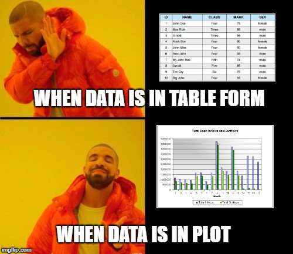

```{r setup, include=FALSE}
library(learnr)
library(shiny)
library(tableone)
library(ggplot2)
library(Hmisc)
library(labelled)

knitr::opts_chunk$set(echo = FALSE)
```

```{r, context="data", include=FALSE}
HeartFailure <- read.csv("./www/heart.csv")

CleanHeartFailure <- readRDS("./www/cleanheartfailure.Rda")
```


## Introduction {data-progressive=TRUE} 

In this lab, you will use everything you have learned in the first three labs plus some new concepts introduced in this lab. You will see the what it takes to complete some simple analyses of the HeartFailure data set from start to finish. 


### Data cleaning 

What is data cleaning? Data cleaning is the first step in any analysis and it is the process of taking data in its "raw" form and making it "clean" so that it can be analyzed. This is a concise answer for an essential and sometimes complicated step in data analysis. For a more detailed description of data cleaning check out Edwin de Jonge and Mark van der Loo's book [An introduction to data cleaning with R](https://cran.r-project.org/doc/contrib/de_Jonge+van_der_Loo-Introduction_to_data_cleaning_with_R.pdf) (yes there are several books wholly dedicated to methods for cleaning data). Data cleaning, in many cases, takes much longer to complete than the actual analysis.  

The HeartFailure data we will use for this lab is already pretty clean but the variable types still need to be set, and some informative labels need to be added.   

### Variable types in R

By now, you know that there are different variable types, and based on the variable type, you will use different methods to summarize or visualize it. 

Also, remember that R is not smart; it does whatever you tell it to. If you write code to create a histogram of a categorical variable R will do it. Cleaning our data will help make R a little smarter about how it handles the variables in our data. Correctly formatting variables types also makes making tables in R much easier.  


### Basic Analyses

#### Making Tables

In nearly all journal articles, the first result is a table that summarizes all of the included variables. R has some great tools to make these tables with minimal coding. In this lab, you will use a function call tableone() check out the [Rdocumenation](https://www.rdocumentation.org/packages/tableone/versions/0.10.0) for the function.

#### To visualize or not to visualize

Data visualization is a powerful tool to gain a better understanding of the variables in your data set but as you may have noticed getting the exact value for a mean or median from a figure is not as easy as reading it from a table. When you are presenting the results of your data analysis, the best practice it to include the numeric summaries either in the figure itself or as a table. Including the numerical summaries in a figure is ideal in some cases but requires more than a single line of code to create. Data visualization is essential and there are entire websites dedicated to visualization techniques. Check out [The R Graph Gallery](https://www.r-graph-gallery.com/) this website has examples of just about every type of visualization imaginable.     

    

## Variable Types in R {data-progressive=TRUE} 

In class, you learn about data or variables as continuous, discrete, and categorical (nominal, ordinal, and dichotomous). There are 6 basic data types in R, and while R does not use the same names we use in class, there are formats in R that correspond to each. 

#### Data types and corresponding R data types:

__continuous data__ should be a "numeric" variable in R. 

__discrete data__ should be an "integer" variable in R 

__categorical data__ should be a "factor" in R (The distinction between nominal and dichotomous is not vital for R, but ordinal data should be specified and is treated differently by R)


OK so let's identify the types of variables we have in our HeartFailure data set and what type of data they should be in R. 

### Exercise 1

**instructions**
Identify the variable type for each of the variables in the data set using the data dictionary and looking at data. Once you have identified the variable types answer questions 1 through 8. 

#### Data Dictionary
__age:__ age in years  
__sex:__ (1 = male; 0 = female)  
__trestbps:__ resting blood pressure (in mm Hg on admission to the hospital)  
__chol:__ serum cholesterol in mg/dl  
__fbs:__ (fasting blood sugar > 120 mg/dl) (1 = true; 0 = false)  
__thalach:__ maximum heart rate achieved  
__exang:__ exercise induced angina (1 = yes; 0 = no)  
__oldpeak:__ ST depression induced by exercise relative to rest 

Complete the code to show the first 10 observations in the HeartFailure data set.
```{r showdata, exercise=TRUE, exercise.lines = 5}
# Once you complete the code click the run code button 
head(HeartFailure, )
```

### Quiz: Questions 1-8 
**Don't forget to write your answers down for the eLC quiz**
Identify the variable type and corresponding R data type for each of the variables.    
To be clear, the variable age, in this case, is recorded as discrete data (whole year not year.months.days) but age is considered a continuous variable since values between 65 and 66 are possible. It is very common for continuous data/variables to be recorded as whole numbers, but that does not make them discrete. So you will have to think about whether or not intermediate values are possible before deciding if a variable data is continuous or discrete.
```{r Q1-8}
quiz(
  question("Select the data type and corresponding R data type for: __age__",
    answer("continuous", correct = TRUE),
    answer("discrete"),
    answer("nominal"),
    answer("ordinal"),
    answer("dichotomous"),
    answer("numeric", correct = TRUE),
    answer("factor"),
    answer("integer"),
  allow_retry = TRUE
  ),
  question("Select the data type and corresponding R data type for: __sex__",
    answer("continuous"),
    answer("discrete"),
    answer("nominal"),
    answer("ordinal"),
    answer("dichotomous", correct = TRUE),
    answer("numeric"),
    answer("factor", correct = TRUE),
    answer("integer"),
  allow_retry = TRUE
  ),
  question("Select the data type and corresponding R data type for: __trestbps__",
    answer("continuous", correct = TRUE),
    answer("discrete"),
    answer("nominal"),
    answer("ordinal"),
    answer("dichotomous"),
    answer("numeric", correct = TRUE),
    answer("factor"),
    answer("integer"),
  allow_retry = TRUE
  ),
  question("Select the data type and corresponding R data type for: __chol__",
    answer("continuous", correct = TRUE),
    answer("discrete"),
    answer("nominal"),
    answer("ordinal"),
    answer("dichotomous"),
    answer("numeric", correct = TRUE),
    answer("factor"),
    answer("integer"),
  allow_retry = TRUE
  ),
  question("Select the data type and corresponding R data type for: __fbs__",
    answer("continuous"),
    answer("discrete"),
    answer("nominal"),
    answer("ordinal"),
    answer("dichotomous", correct = TRUE),
    answer("numeric"),
    answer("factor", correct = TRUE),
    answer("integer"),
  allow_retry = TRUE
  ),
  question("Select the data type and corresponding R data type for: __thalach__",
    answer("continuous"),
    answer("discrete", correct = TRUE),
    answer("nominal"),
    answer("ordinal"),
    answer("dichotomous"),
    answer("numeric"),
    answer("factor"),
    answer("integer", correct = TRUE),
  allow_retry = TRUE
  ),
  question("Select the data type and corresponding R data type for: __exang__",
    answer("continuous"),
    answer("discrete"),
    answer("nominal"),
    answer("ordinal"),
    answer("dichotomous", correct = TRUE),
    answer("numeric"),
    answer("factor", correct = TRUE),
    answer("integer"),
  allow_retry = TRUE
  ),
  question("Select the data type and corresponding R data type for: __oldpeak__",
    answer("continuous", correct = TRUE),
    answer("discrete"),
    answer("nominal"),
    answer("ordinal"),
    answer("dichotomous"),
    answer("numeric", correct = TRUE),
    answer("factor"),
    answer("integer"),
  allow_retry = TRUE
  )
)
```


## Checking Variable Types in R {data-progressive=TRUE}
Now that we have identified the data types and the corresponding R data type for each variable, let's see how the variables are currently saved. It is important to know that when you import data into R, it tries to give variables the correct format but it very rarely gets it 100% right. 

We will use the str() function to see how accurate R was when it assigned variable types. The str() function shows the "structure" of data and variables. We will use the output to see if anything needs to change (click [here](https://www.rdocumentation.org/packages/utils/versions/3.6.0/topics/str) for more information on the str() function). 


### Exercise 2
**instructions** Run the code and see the explanation of the output. Then answer the question.
```{r variable types, exercise=TRUE}
#Click run code
str(HeartFailure)

```

Here is what the output means using line 1 and 2 as examples. 

The first line of the output tells us about the overall structure: R imported the data from an excel spreadsheet as a "data.frame" with 303 observations (rows) and 8 variables (columns)

The second line starts with a "**$**" letting you know that it is a variable inside the data.frame (remember data set\$variable name). Then the name of the variable in this case "age". The variable name is followed by a "**:**" and then a three letter abbreviation for the variable type, which, for the age variable is "int" for integer. So when the data was imported R looked at the data and saw only whole numbers and applied the integer label. The numbers following the variable type are the first 10 values for that variable.

So now that you know that the output means you can answer the following question.

```{r Q9}
  question("Which variables need to have their variable types changed",
    answer("age", correct = TRUE),
    answer("sex", correct = TRUE),
    answer("trestbps", correct = TRUE),
    answer("chol", correct = TRUE),
    answer("fbs", correct = TRUE),
    answer("thalach"),
    answer("exang", correct = TRUE),
    answer("oldpeak"),
  allow_retry = TRUE
  )
```

## Data Cleaning R {data-progressive=TRUE}


So R was only right about the variable type for 2 of the 8 variables (I told you R is not smart, but it is OK because you are). Thankfully changing the variable type in R is very easy. The basic syntax is shown in the table below.

<style type="text/css">
.tg  {border-collapse:collapse;border-spacing:0;border-color:#9ABAD9;margin:0px auto;}
.tg td{font-family:Arial, sans-serif;font-size:14px;padding:10px 5px;border-style:solid;border-width:1px;overflow:hidden;word-break:normal;border-color:#9ABAD9;color:#444;background-color:#EBF5FF;}
.tg th{font-family:Arial, sans-serif;font-size:14px;font-weight:normal;padding:10px 5px;border-style:solid;border-width:1px;overflow:hidden;word-break:normal;border-color:#9ABAD9;color:#fff;background-color:#409cff;}
.tg .tg-88nc{font-weight:bold;border-color:inherit;text-align:center}
.tg .tg-uys7{border-color:inherit;text-align:center}
.tg .tg-du1j{font-size:16px;border-color:inherit;text-align:center}
</style>
<table class="tg">
  <tr>
    <th class="tg-88nc">Where the changed variable is saved</th>
    <th class="tg-88nc">Assignment Operator (tells R where to store changes)</th>
    <th class="tg-88nc">Function (makes desired change to the variable)</th>
  </tr>
  <tr>
    <td class="tg-uys7">data\$variable</td>
    <td class="tg-du1j"><span style="font-weight:bold">&lt;-</span></td>
    <td class="tg-uys7">function(data\$variable)</td>
  </tr>
</table>

### Code to change the data type 

Since this is not a coding class, I have written all the code to change the variables. But since I am sure you are curious how I did it the code is shown below. I only had to use two functions as.numeric() and as.factor(). I have already completed this the code is only included so you can see how I did it. It is important to notice that the changes the code makes to the variables are saved in a new data set called "**CleanHeartFailure**".   
```{r clean up, eval=FALSE, echo=TRUE}

#This line of code replaces the integer "age" with numeric "age" 
CleanHeartFailure$age<-as.numeric(HeartFailure$age)

#This line of code replaces the integer "sex" with factor "sex" 
CleanHeartFailure$sex<-as.factor(HeartFailure$sex)

#This line of code replaces the integer "trestbps" with numeric "trestbps" 
CleanHeartFailure$trestbps<-as.numeric(HeartFailure$trestbps)

#This line of code replaces the integer "chol" with numeric "chol" 
CleanHeartFailure$chol<-as.numeric(HeartFailure$chol)

#This line of code replaces the integer "fbs" with factor "fbs" 
CleanHeartFailure$fbs<-as.factor(HeartFailure$fbs)

#This line of code replaces the integer "chol" with numeric "chol" 
CleanHeartFailure$thalach<-as.numeric(HeartFailure$thalach)

#This line of code replaces the integer "exang" with factor "exang" 
CleanHeartFailure$exang<-as.factor(HeartFailure$exang)

```


### Decoding the data

Using numbers to represent words used to be required since old computers did not have enough memory to store a bunch of text. The second reason is that for a long time, statistical software could only work with numerical values. With modern computers and R, neither of those limitations are an issue. 

So why keep using abbreviations for variable names?  Well, it is much easier and faster to type summary(HeartFailure\$fbs) compared to summary(HeartFailure\$fastingbloodsugarlessthan120).  To help make tables and figures nicer, we can add long and descriptive "labels" our variables. You still code using the abbreviated variable names. Labels are only used by R  when you make figures or tables.   

If R can use text, why use numeric values for categories? Many of the underlying processes still require a numerical value, but just like the variables, we can create informative "labels" for the levels of a factor that R only uses when we make plots or tables.   

Even if the data is not coded and the variable names are very descriptive, a data dictionary should be made for all data sets.

All the code to complete the task is provided. Take a look to see if you can understand what's happening. 
```{r label factor levels, eval=FALSE, echo=TRUE}

# R calls the categories of a factor "levels" 
# The factor variable sex has two levels (0,1) 
# Below I will add some informative labels to each level
# For sex the first level is 0 so the first label needs to be "Female"
CleanHeartFailure$sex<-factor(HeartFailure$sex, labels = c("Female","Male"))

# For fbs the first level is 0 so the first label needs to be "No"  
CleanHeartFailure$fbs<-factor(HeartFailure$fbs, labels = c("No","Yes"))

# For exang the first level is 0 so the first lable needs to be "No"
CleanHeartFailure$exang<-factor(HeartFailure$exang, labels = c("No","Yes"))


# Assign the labels I want for each variable
var_Label_List <- list(age="Age in Years", 
                       sex="Sex of the patient", 
                       trestbps="Resting Blood Pressure (mm Hg)", 
                       chol="Serum Cholesterol (mg/dl)", 
                       fbs="Fasting Blood Sugar > 120 mg/dl", 
                       thalach="Maximum Recorded Heart Rate (bpm)", 
                       exang="Exercise Induced Angina", 
                       oldpeak="Exercise Induced ST Depression Relative to Rest")

# Use the labeling function from the labeled package to attach 
labelled::var_label(CleanHeartFailure)<-var_Label_List

```


## Clean Vs. Uncleaned data {data-progressive=TRUE}


Now that we have cleaned up our data run the code in the exercise. The first chunk is using the "clean" data, and the second chunk is the "uncleaned" data. Compare the differences between the outputs. 

#### Data Dictionary
__age:__ age in years  
__sex:__ (1 = male; 0 = female)  
__trestbps:__ resting blood pressure (in mm Hg on admission to the hospital)  
__chol:__ serum cholesterol in mg/dl  
__fbs:__ (fasting blood sugar > 120 mg/dl) (1 = true; 0 = false)  
__thalach:__ maximum heart rate achieved  
__exang:__ exercise induced angina (1 = yes; 0 = no)  
__oldpeak:__ ST depression induced by exercise relative to rest 

### Exercise 3
**instructions** Run the code for the first two code chunks and see the difference in the output. In the third chunk write your own code to produce a summary for "exang" and a box plot of resting blood pressure stratified by "exang". Hint: remember to use the right data. Once you are done, run your code and answer the questions below. 
```{r compare clean data, exercise=TRUE}
# Chunk 1: Using clean data
summary(CleanHeartFailure$sex)

boxplot(chol~sex, data = CleanHeartFailure)

```

```{r compare unclean data, exercise=TRUE}
# Chunk 2: Using unclean data
summary(HeartFailure$sex)

boxplot(chol~sex, data = HeartFailure)
```

```{r compare exang and trestbps, exercise=TRUE}
# Chunk 3: Write the code to make a summary of "exang" and the stratified box plot specified in the instructions

```


### Quiz: Questions 10-12
```{r Q10-12}
quiz(
  question("Is the summary for sex in chunk 2 correct?",
    answer("Yes, knowing the mean and median is always important"),
    answer("No, counts or relative frequencies should be shown", correct = TRUE),
    answer("Yes, Q1 and Q2 should always been shown"),
  allow_retry = TRUE
  ),
  question("How many patients have exercise induced angina?",
    answer("99", correct = TRUE),
    answer("204"),
    answer("105"),
    answer("303"),
  allow_retry = TRUE
  ),
  question("Is the distribution of resting blood pressure different when stratified by exang?",
    answer("Yes, The median is higher for those with exang = Yes"),
    answer("No, They are very similar", correct = TRUE),
    answer("Yes, The median is lower for those with exang = Yes"),
    answer("No, The box plot shows the means are different"),
  allow_retry = TRUE
  )
)
```


## Basic Analysis and Interpretations {data-progressive=TRUE}

We have cleaned up our data, and now we are ready to complete some basic analyses. 


### Summary Tables

One of the most common results presented is "Table 1", which provides numerical summaries for all of the variables in the data set. There are many ways to make a table using R. The first and least appealing method is to run a summary of each variable or the data set and then copy the values into a table in word or excel. The second is using functions in R to generate a beautiful table using just a few lines of code. 

### Exercise 4
**Instructions** Take a look at the code and then run it. Use the output to answer the questions below. Note: The output in the box is what the table looks like before being turned into an HTML table. 
```{r tabelone, exercise=TRUE}

# Here we create an object with all the variable names we want to include. 
listVars <- c("age", "trestbps", "chol", "thalach", "oldpeak", "exang", "sex", "fbs")

# This code tells the function to make the table.
table <- CreateTableOne(vars = listVars, data = CleanHeartFailure)

# This code saves the table in the table1
table1<-print(table, varLabels = TRUE, showAllLevels = T)

# This code formats the table and adds a caption
knitr::kable(table1, caption = "**This is the table we easily created using some clean data and the tableone() function.**")

```


### Quiz: Question 13-15
```{r Q13-15}

quiz(
  question("Is the summary for sex in this table correct?",
    answer("Yes, knowing the mean and median is always important"),
    answer("No, counts or relative frequencies should be shown"),
    answer("Yes, now it shows the frequency and relative frequency", correct = TRUE),
  allow_retry = TRUE
  ),
  question("How many patients have a fasting blood sugar > 120mg/dl?",
    answer("45", correct = TRUE),
    answer("258"),
    answer("153"),
    answer("330"),
  allow_retry = TRUE
  ),
  question("Among the continuous and discrete variables which is the most variable?",
    answer("Age"),
    answer("Serum Cholesterol", correct = TRUE),
    answer("Maximum Recorded Heart Rate"),
    answer("Resting Blood Pressure"),
    answer("Exercise Induced ST Depression Relative to Rest"),
  allow_retry = TRUE
  )
)


```


### Figures with numerical summaries

Figures with numerical summaries are the best. They allow you to quickly to see the characteristics of the distribution and the exact values of numeric summaries (mean, median, max, min, etc.).  Making these figures takes a little more effort but are well worth the effort. Making these plots will be made using an R package called ggpplot2 () 

### Exercise 5
**Instructions** Look at the code below just so you can see that it takes a lot more then hist() to make a nicer histogram. You see if you can figure out which part of the code does what. Answer the question based on the interpretation of histogram. 
```{r, eval=TRUE, echo=TRUE}
# Saving all the summary statistics that I want to include in the plot in the "statvalue" object.  
statvalue<-c(median(CleanHeartFailure$age), mean(CleanHeartFailure$age), max(CleanHeartFailure$age), min(CleanHeartFailure$age))

# This is the all the code it takes to make the actual plot 
ggplot(CleanHeartFailure, aes(age))+ 
  geom_histogram(binwidth = round((3.5*(sd(CleanHeartFailure$age)/303^(1/3))),0), fill="gray", color="black")+
  stat_bin(binwidth = round((3.5*(sd(CleanHeartFailure$age)/303^(1/3))),0), geom='text', aes(label=..count..), vjust=-.60)+
  labs(x=label(CleanHeartFailure$age), y="Patient Count")+
  scale_y_continuous(breaks=c(seq(0,80,by=5)), labels=c(seq(0,80,by=5)), limits = c(0,75))+
  scale_x_continuous(breaks=seq(27.5,87.5,by=5))+
  geom_vline(aes(xintercept=statvalue[1], color="Median (55 years)"))+
  geom_vline(aes(xintercept=statvalue[2], color="Mean (54.37 years)"))+
  geom_vline(aes(xintercept=statvalue[3], color="Max (77 years)"))+
  geom_vline(aes(xintercept=statvalue[4], color="Minimum (29)"))+
  scale_color_manual(values = c("red","blue","green","orange"),
                     name="Summary Statistics")+
        theme(plot.title = element_text(size = 14, face = "bold", hjust = 0.5), 
                         plot.subtitle = element_text(size = 14, face = "bold"),
                         axis.title.x = element_text(size = 16, face = "bold"),
                         axis.title.y = element_text(size = 16, face = "bold"),
                         panel.background = element_rect(fill = "white", color = "black"),
                         panel.grid.major = element_blank(),
                         panel.grid.minor = element_blank())
```

The plot shows you the distribution age in the data, the start and end value for each bin, the exact count of patients in each bin, the value and location numeric value of the summary statistics (minimum, mean, median, max).

### Quiz: Question 16
```{r Q16}
  question("What is the most common age range for these patients?",
    answer("32.5-37.5"),
    answer("52.5-57.5"),
    answer("67.5-72.5"),
    answer("57.5-62.5", correct = TRUE),
  allow_retry = TRUE
  )
```


## Summary

In this lab, you completed 5 exercises, and answered 16 quiz question related to the following topics:  
1. how the data types we learn in class correspond to R data types  
2. how to clean up your data  
3. how to make a summary table of all the variables in the data set   
4. what it takes to make informative figures   
5. interpreting the results of a basic analysis   

Excellent! You have finished the lab. **Don't forget to record your answers and take the eLC quiz, so you get credit**


```{r joke, fig.cap="from: https://towardsdatascience.com/data-visualization-for-machine-learning-and-data-science-a45178970be7 "}



```
