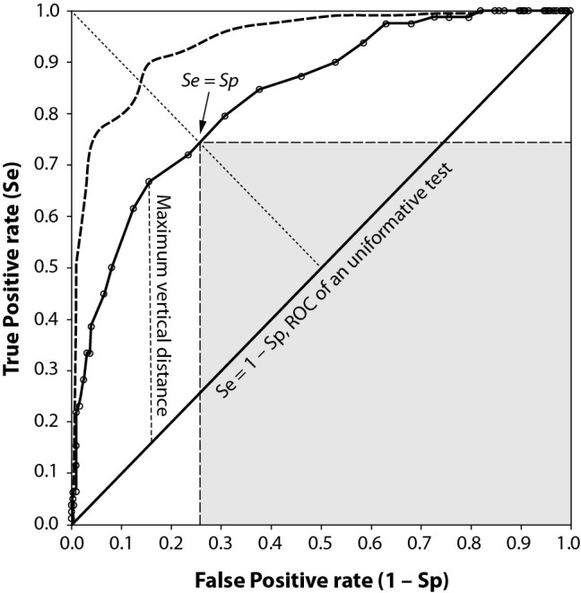
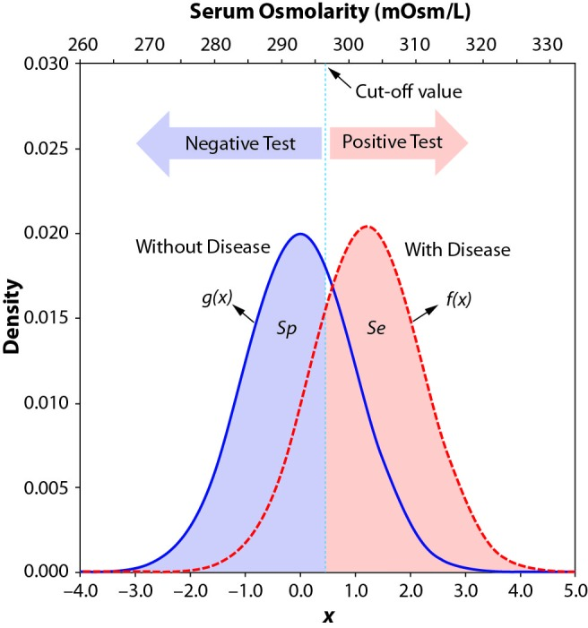
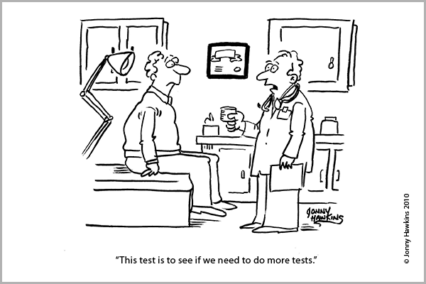

```{r setup, include=FALSE}
library(iblir)
knitr::opts_chunk$set(echo = FALSE)
```

```{r, context="data", include=FALSE}
MedTest<- readRDS("./www/medtest.Rda")

```

## Introduction 

This lab will cover: Diagnostic and Screening tests, Sensitivity, Specificity, Accuracy, ROC curves, AUC calculations, and Cut-off values. 

## Diagnostic and Screening Tests {data-progressive=TRUE}

Medical tests are a tool used by medical professionals to screen for and diagnose disease in patients. If you are curious about what the difference is between screening and diagnostic tests check out the comparison from [Health Knowledge](https://www.healthknowledge.org.uk/public-health-textbook/disease-causation-diagnostic/2c-diagnosis-screening/screening-diagnostic-case-finding). There are too many tests to list, but it is important to understand that not all tests require labs and sample collections. A single question or series of questions can be used as a test by a medical professional. There are also several medical tests that people use themselves like home pregnancy tests or blood sugar tests for individuals with diabetes. These at-home tests are administered and interpreted by an individual, in the case of some test like a home pregnancy test a doctor does a follow-up test to confirm the results. [Click here to see a list of FDA approved home tests](https://www.fda.gov/medical-devices/vitro-diagnostics/home-use-tests).  


The value of a test can be dichotomous, discrete, or continuous. An example of a dichotomous test is a single question. For example, when you are sick, the doctor or nurse may ask if you or someone you know has been out of the country in the last three week.  That simple question is a test to see if they should consider any diseases that may be common in the country you or someone you know visited. The result of this test is dichotomous (YES or NO). If the doctor asks a series of related questions, they may count the number of times you say yes. The result of this test is discrete (1,2,3,4, or 5 questions with a yes answer). For a home pregnancy test, which measures the concentration (mIU/Ml) of the human chorionic gonadotropin (hCG) hormone, the result is continuous, but it is shown as simply positive or negative.       


The way the results of a test are presented is critical, especially for the patient. Test result that are continuous or discrete can be reported two ways, either quantitatively or qualitatively. A quantitative test result is the numeric value of the test (e.i. hCG=6.32). A qualitative test result is the interpretation of the numeric test value (e.i. "positive", "negative"). Remember this only applies to tests that generate continuous or discrete values, some tests are qualitative by design like the yes-no questions. Choosing which way to present the results of the test is very important.      


Have you ever actually looked at the results of your blood tests from your yearly physical? The table below shows a made-up example of the results for some of the standard blood tests. Of the nine results shown, three are normal, three are abnormally high, and three are abnormally low. So which tests are normal, low, or high? Don't worry. That is not one of the quiz questions. Doctors recognized that giving information like the table above to a patient was an issue, so now in most cases, test results are sent to a patient with explanations of the results or are explained in a follow-up visit.      

<style type="text/css">
.tg  {border-collapse:collapse;border-spacing:0;border-color:#ccc;margin:0px auto;}
.tg td{font-family:Arial, sans-serif;font-size:14px;padding:10px 5px;border-style:solid;border-width:0px;overflow:hidden;word-break:normal;border-top-width:1px;border-bottom-width:1px;border-color:#ccc;color:#333;background-color:#fff;}
.tg th{font-family:Arial, sans-serif;font-size:14px;font-weight:normal;padding:10px 5px;border-style:solid;border-width:0px;overflow:hidden;word-break:normal;border-top-width:1px;border-bottom-width:1px;border-color:#ccc;color:#333;background-color:#f0f0f0;}
.tg .tg-zlqz{font-weight:bold;background-color:#c0c0c0;border-color:inherit;text-align:center;vertical-align:top}
.tg .tg-c3ow{border-color:inherit;text-align:center;vertical-align:top}
.tg .tg-6e8n{font-weight:bold;background-color:#c0c0c0;border-color:inherit;text-align:left;vertical-align:top}
.tg .tg-0pky{border-color:inherit;text-align:left;vertical-align:top}
</style>
<table class="tg">
  <tr>
    <th class="tg-6e8n">Test Name</th>
    <th class="tg-zlqz">Result</th>
  </tr>
  <tr>
    <td class="tg-0pky">White Blood Cell</td>
    <td class="tg-c3ow">6.9 K/mcL</td>
  </tr>
  <tr>
    <td class="tg-0pky">Red Blood Cell</td>
    <td class="tg-c3ow">1.8 M/mcL</td>
  </tr>
  <tr>
    <td class="tg-0pky">Hemoglobin</td>
    <td class="tg-c3ow">6.5 g/dL</td>
  </tr>
  <tr>
    <td class="tg-0pky">Hematocrit</td>
    <td class="tg-c3ow">19.5%</td>
  </tr>
  <tr>
    <td class="tg-0pky">Mean Cell Volume</td>
    <td class="tg-c3ow">109.6 fL</td>
  </tr>
  <tr>
    <td class="tg-0pky">Mean Cell Hemoglobin</td>
    <td class="tg-c3ow">36.5 pg</td>
  </tr>
  <tr>
    <td class="tg-0pky">Mean Cell Hb Conc</td>
    <td class="tg-c3ow">33 g/dL</td>
  </tr>
  <tr>
    <td class="tg-0pky">Red Cell Dist Width</td>
    <td class="tg-c3ow">16.0%</td>
  </tr>
  <tr>
    <td class="tg-0pky">Platelet Count</td>
    <td class="tg-c3ow">180 K/mcL</td>
  </tr>
</table>  


For the table above the qualitative results of "normal", "low" or "high" is the information you are most likely concerned with. Patients generally do not know what to do with quantitative test results. Could you imagine getting the quantitative result of "42" for a pregnancy test? What does that mean? On the other hand, if a diabetic person checks their blood sugar and the result was "You're Good". That is not enough information for someone who needs to monitor their blood sugar closely. Think about it, if "You're Good"  means the measured blood sugar is somewhere between 80-179 mg/dL could a diabetic person make the right decision about what or when they eat next? The answer is no. The reaction to a blood sugar reading of 169 mg/dL is likely not the same as a reading of 89 mg/dL.     

## Sensitivity, Specificity, and Accuracy {data-progressive=TRUE}

You have learned about sensitivity and specificity in the lecture as the probability of the test being either positive or negative when the disease is present or absent. Calculating the sensitivity and specificity for tests with dichotomous results is easy and only takes on a single value for each. Another characteristic is the accuracy of the test. The accuracy is a measure of how well the test does classifying patients as true positives (TP) and true negatives (TN). To calculate accuracy, you add the number of true positives and true negatives and then divide by the table total (table total is just all the numbers in the table added up).     

### Exercise 1: Sensitivity and Specificity (Dichotomous)

**Instructions:** We will work with some data for a test to screen for _The Scarlet Plague_ ([CDC info for scarlet plague](https://wwwnc.cdc.gov/eid/article/20/10/13-0278_article)). The data has six variables. The data dictionary is shown below. Use the data and calculate the sensitivity, specificity, and accuracy ((TP+TN)/Total) using the dichotomous variable "answer" in the "MedTest" data set. For information about how to calculate sensitivity and specificity click [here](https://en.wikipedia.org/wiki/Sensitivity_and_specificity). Use the table generated by the code below to answer quiz questions 1-3. 

**Data Dictionary**  
**disease_statusC:** Disease status of the patient using the gold standard (Culture) as a character value  
**disease_status:** Disease status of the patient using the gold standard (Culture) as a numeric value (0=Disease Present, 1=No Disease)  
**answer:** Qualitative response (Yes or No) to a single question. "Have you been to New York in the last two weeks?"  
**test1:** Quantitative measurement value of the PCR test  
**test2:** Quantitative measurement value of the sputum antigen test  
**test3:** Quantitative measurement value of the nasal antigen test  


```{r make2X2table, exercise=TRUE, exercise.lines = 5}
# For a dichotomous test value we can make a 2 X 2 table 
# To make a 2x2 table we will use the table() function 
# The first variable listed will be the rows
# The second variable listed will be the columns 
table(MedTest$answer,MedTest$disease_statusC)
```

### Quiz: Questions 1-3

```{r Q1-3}
  quiz(
  question("What is the sensitivity **AND** specificity for the question?",
    answer("0.62", message = "Nice work!", correct = TRUE),
    answer("0.10", message = "Make sure you are using the right cells of the 2x2 table"),
    answer("0.41", message = "Got it!", correct = TRUE),
    answer("0.44", message = "Make sure you are using the right cells of the 2x2 table"),
  allow_retry = TRUE
  ),
  question("What is the prevalence of disease in the study population?",
    answer("0.42", message = "Make sure you are using the margins of the 2x2 table"),
    answer("0.88", message = "Make sure you are using the margins of the 2x2 table"),
    answer("0.46", correct = TRUE),
    answer("0.30", message = "Make sure you are using the margins of the 2x2 table"),
  allow_retry = TRUE
  ),
  question("What is the accuracy of the question test?",
    answer("0.42", message = "Remember for accuracy you have to use TP and TN"),
    answer("0.53", correct = TRUE),
    answer("0.60", message = "Remember for accuracy you have to use TP and TN"),
    answer("0.45", message = "Remember for accuracy you have to use TP and TN"),
  allow_retry = TRUE
  )
)
```


### Tables to calculate Sensitivity, Specificity, and Accuracy

Tests that generate numeric values can have a huge number of possible "cut-offs" to classify a person as positive or negative. Using a pregnancy test as an example. The concentration of human chorionic gonadotropin (hCG) ranges from 0 to 288,000 mIU/mL. If you didn't know a lot of about the biology of hCG, it would take a long time to calculate the sensitivity, specificity, and accuracy for even a fraction of the possible cut-off values using the table method you used above. To see the test's performance over all the possible values, we will use a ROC curve. 


## ROC Curves {data-progressive=TRUE}

What are ROC curves? ROC stands for receiver operating characteristics they are used to visualize the performance of classifiers. A classifier is a general term, but in our class, the classifiers we care about are screening and diagnostic tests. Remember that as sensitivity increases or decreases, specificity decreases or increases accordingly. As a result, the ROC curve plots the sensitivity on the Y-axis and 1-specificity on the X-axis for all of the different "cut-offs". For more detailed information about ROC curves for medical testing take a look at the paper paper by Nancy Obuchowski [Receiver operating characteristic (ROC) curves: review of methods with applications in diagnostic medicine](https://iopscience.iop.org/article/10.1088/1361-6560/aab4b1/meta). ROC analysis is also used for a number of other applications and if you want to know more about it check out this paper by Tom Fawcett [An introduction to ROC analysis](https://doi.org/10.1016/j.patrec.2005.10.010).


The figure below summarizes all the different characteristics of the ROC curve. The most basic interpretation of a ROC curve is observing how close the curve gets to the top left-hand corner. The closer the test's curve gets to the top left-hand corner, the better the test is. The diagonal line is there as a reference and values that along the line are not very useful. When the test's ROC curve is on the diagonal line, flipping a coin would be just as good at identifying disease.

```{r AUCCutOff, fig.cap="_The general structure of a ROC curve. The curve (dashed line) which lies completely above another curve (solid line), is clearly a better test because it has a higher area under the curve. Having the left-upper corner moving on ROC curve (solid line), the area of the shaded rectangular region is maximum when its sides (Se and Sp) are equal. Se – sensitivity. Sp – specificity._ **From:** Habibzadeh F, Habibzadeh P, Yadollahie M. On determining the most appropriate test cut-off value: the case of tests with continuous results. Biochem Med (Zagreb). 2016;26(3):297–307. doi:10.11613/BM.2016.034"}



```

 
### Exercise 2: Making ROC Curve

**Instructions:** Using the same data from exercise 1, we will make a ROC curve for each test. Look at the ROC curves for the three different tests. You can plot one at a time or all three at once. Using the information present above, you will interpret the curves to answer the quiz questions. 

**Data Dictionary**  
**disease_statusC:** Disease status of the patient using the gold standard (Culture) as a character value  
**disease_status:** Disease status of the patient using the gold standard (Culture) as a numeric value (0=Disease Present, 1=No Disease)  
**answer:** Qualitative response (Yes or No) to a single question. "Have you been to New York in the last two weeks?"  
**test1:** Quantitative measurement value of the PCR test  
**test2:** Quantitative measurement value of the sputum antigen test  
**test3:** Quantitative measurement value of the nasal antigen test  

**Note:** The values along the curve are the cut-off values. For example, for test1 using a cut-off value of 22.9 gives the test a sensitivity around 0.85 and a specificity of 0.96 (remember the x-axis is 1-specificity).
```{r, context="render", echo=FALSE}

fluidRow(column(4, checkboxGroupInput("tests", "Select a Test:",
                               choices=c("test1","test2","test3")))
)


plotOutput("plot1")

```


```{r, context="server"}

  # Creating histogram based on selections
output$plot1 <- renderPlot({
  
  # Make sure they select a variable to plot
  validate(need(!is.null(input$tests), 'Please select a test to show the ROC plot.'))
  
  if(length(input$tests)==1){
    # if only one test is selected then basic plot
    mtitle<-sprintf("ROC Curve for %s",input$tests)
       ggplot(data=MedTest, aes(d=disease_status, m=MedTest[,c(input$tests)]))+
           geom_roc(color="blue")+
           style_roc(xlab = "1-Specificity", ylab = "Sensitivity")+
           ggtitle(mtitle)+
           geom_abline(slope = 1, intercept = 0, size = 0.75, color = 'black')+
         theme(plot.title = element_text(size = 14, face = "bold", hjust = 0.5), 
                         axis.title.x = element_text(size = 16, face = "bold"),
                         axis.title.y = element_text(size = 16, face = "bold"),
                         axis.text = element_text(size = 14),
                         legend.title = element_text(size = 16, face = "bold"),
                         legend.text = element_text(size = 14),
                         legend.direction = "horizontal",
                         legend.position = "bottom",
                         panel.background = element_rect(fill = "white", color = "black"))
    
  }else{
    # more than one test then melt data into long data then plot 
    data<-melt_roc(MedTest, "disease_status", c(input$tests))
       ggplot(data=data, aes(d=D, m=M, color= name))+
           geom_roc()+
           style_roc(xlab = "1-Specificity", ylab = "Sensitivity")+
           labs(color="Test")+
           ggtitle("ROC Curves for Selected Tests")+
           geom_abline(slope = 1, intercept = 0, size = 0.75, color = 'black')+
         theme(plot.title = element_text(size = 14, face = "bold", hjust = 0.5), 
                         axis.title.x = element_text(size = 16, face = "bold"),
                         axis.title.y = element_text(size = 16, face = "bold"),
                         axis.text = element_text(size = 14),
                         legend.title = element_text(size = 16, face = "bold"),
                         legend.text = element_text(size = 14),
                         legend.direction = "horizontal",
                         legend.position = "bottom",
                         panel.background = element_rect(fill = "white", color = "black"))
         }

})


```

### Quiz: Questions 4-5

```{r Q4-5}
  quiz(
  question("Which test is the best?",
    answer("test1", correct = TRUE),
    answer("test3", message = "The test closest to the top left corner is the best overall"),
    answer("test2", message = "The test closest to the top left corner is the best overall"),
  allow_retry = TRUE
  ),
  question("Below which cut-off value is test3 just as good as flipping a coin?",
    answer("19.6", message = "This value is on the line but so are higher ones"),
    answer("20.4", message = "This value is on the line but so are higher ones"),
    answer("21.2", message = "This value is on the line but so are higher ones"),
    answer("22.8", message = "Great work! After this value the test is consistently above the 50/50 line", correct = TRUE),
  allow_retry = TRUE
  )
)
```


## AUC calculations {data-progressive=TRUE}

What is AUC? AUC stands for the area under the curve. In this lab, we care about the area under the ROC curve. The AUC is a summary of a tests overall performance. The AUC can also be used to compare multiple tests without having to rely on a visual inspection of a plot. There are several ways to calculate AUC, but for this class, you only need to understand how to interpret the values. An AUC can be any value between 0 and 1. An AUC of 1 is the perfect test it correctly classifies disease presence or absence. An AUC of 0 is the perfectly wrong test it classifies all those with a disease as being disease free and all those that are disease free as having a disease. An AUC of 0.5 is a test that does not contribute any meaningful information about the disease status of a patient (you would do just as well guessing). The diagonal line on the ROC plot corresponds to an AUC of 0.5 (it divides the area of the plot in half). The numeric value of the AUC can be thought of as the probability the test correctly classifying patients as diseased or disease-free. A test with an AUC of 0.85 suggests the test has an 85% chance of accurately distinguishing between a disease-free and diseased patient. There are no set rules for what a "good" AUC value is since there are a bunch of other factors to consider, for instance, is it the only test or is it useful for ruling in a disease or ruling out disease. For this class, and as a general guideline, use the table below to judge how good a test is based on AUC.  

<style type="text/css">
.tg  {border-collapse:collapse;border-spacing:0;border-color:#ccc;margin:0px auto;}
.tg td{font-family:Arial, sans-serif;font-size:14px;padding:10px 5px;border-style:solid;border-width:0px;overflow:hidden;word-break:normal;border-top-width:1px;border-bottom-width:1px;border-color:#ccc;color:#333;background-color:#fff;}
.tg th{font-family:Arial, sans-serif;font-size:14px;font-weight:normal;padding:10px 5px;border-style:solid;border-width:0px;overflow:hidden;word-break:normal;border-top-width:1px;border-bottom-width:1px;border-color:#ccc;color:#333;background-color:#f0f0f0;}
.tg .tg-uys7{border-color:inherit;text-align:center}
.tg .tg-xldj{border-color:inherit;text-align:left}
</style>
<table class="tg">
  <tr>
    <th class="tg-xldj">AUC value</th>
    <th class="tg-uys7">Qualitative Assessment</th>
  </tr>
  <tr>
    <td class="tg-xldj">1.0 - 0.90</td>
    <td class="tg-uys7">Excellent</td>
  </tr>
  <tr>
    <td class="tg-xldj">0.89-0.80</td>
    <td class="tg-uys7">Good</td>
  </tr>
  <tr>
    <td class="tg-xldj">0.79 - 0.70 </td>
    <td class="tg-uys7">Fair</td>
  </tr>
  <tr>
    <td class="tg-xldj">0.69-0.60</td>
    <td class="tg-uys7">Poor</td>
  </tr>
  <tr>
    <td class="tg-xldj">0.59-0.51</td>
    <td class="tg-uys7">Worthless (in most cases)</td>
  </tr>
</table>


### Exercise 3: Calculating 
**Instructions:** Using the scarlet plague data, complete the code below to calculate the AUC for tests 2 and 3. To calculate the AUCs for the three tests, we are going to use the [auc()](https://www.rdocumentation.org/packages/pROC/versions/1.14.0/topics/auc) function. Use the results to answer questions 6-8. 

**Data Dictionary**  
**disease_statusC:** Disease status of the patient using the gold standard (Culture) as a character value  
**disease_status:** Disease status of the patient using the gold standard (Culture) as a numeric value (0=Disease Present, 1=No Disease)  
**answer:** Qualitative response (Yes or No) to a single question. "Have you been to New York in the last two weeks?"  
**test1:** Quantitative measurement value of the PCR test  
**test2:** Quantitative measurement value of the sputum antigen test  
**test3:** Quantitative measurement value of the nasal antigen test  

```{r auc_calculation, exercise=TRUE, exercise.lines = 10}
# The first term is the disease status and the second is the test you want to calculate the AUC for.
# test1
auc(MedTest$disease_status, MedTest$test1)

# test2
auc()

# test3 
auc()
```

### Quiz: Questions 6-8

```{r Q6-8}
  quiz(
  question("What is the AUC for test2?",
    answer("0.50", message = "Make sure the second entry in the auc functions is MedTest$test2"),
    answer("0.89", message = "Make sure the second entry in the auc functions is MedTest$test2"),
    answer("0.98", message = "Make sure the second entry in the auc functions is MedTest$test2"),
    answer("0.86", message = "Great work! You will be a master R coder in no time", correct = TRUE),
  allow_retry = TRUE
  ),
  question("What is the AUC for test3?",
    answer("0.86", message = "Make sure the second entry in the auc functions is MedTest$test3"),
    answer("0.98", message = "Make sure the second entry in the auc functions is MedTest$test3"),
    answer("0.58", message = "You are on a roll!", correct = TRUE),
    answer("0.89", message = "Make sure the second entry in the auc functions is MedTest$test3"),
  allow_retry = TRUE
  ),
  question("The AUC values correspond to what you observed in the ROC plots.",
    answer("True", message = "Nailed it!" , correct = TRUE),
    answer("False", message = "Remember the higher the AUC the more bowed the ROC curve is."),
  allow_retry = TRUE
  )
)
```

## Cut-off Values {data-progressive=TRUE}

What is a cut-off value? A cut-off value for a test is the value above or below which a person is considered positive. For example, even though the range of human chorionic gonadotropin (hCG) concentrations is from 0 to 288,000 mIU/mL the cut-off for having a positive test is hCG > 5. The very low cut-off is because in almost all cases, hCG is only present when a woman is pregnant. The figure below shows the distributions of Serum Osmolarity test values for diseased and non-diseased individuals. For the test in the plot, the higher the test values, the more likely you are to have a disease.  As you can see the cut off value determines the number of false positives (area under the blue curve to the right of the cut-off) and false negatives (area under the red curve that is to the left of the cut-off).      

```{r HistCutOff, fig.cap="_The probability density functions of a continuous diagnostic test for diseased (f(x), red dashed line) and non-diseased (g(x), blue solid line) persons. g(x) has a mean of 0 and a standard deviation of 1; f(x) has a mean of d and a standard deviation of s. The cut-off value is represented by the vertical dotted line. All test values equal or greater than this value are considered positive (T+), else they are considered negative (T–). Because f(x) and g(x) are probability density functions, the area under the curve for each of them is equal to one. The area under f(x) to the right of the cut-off value (the pink region) is Se, and the area under g(x) to the left of the cut-off value (the light blue region) is Sp. This figure is drawn based on the first data set (N = 400) presented in the text. There are two x axes: the upper axis indicates serum osmolarity of the studied people; the lower axis represents the corresponding standardized values._ **From:** Habibzadeh F, Habibzadeh P, Yadollahie M. On determining the most appropriate test cut-off value: the case of tests with continuous results. Biochem Med (Zagreb). 2016;26(3):297–307. doi:10.11613/BM.2016.034"}



```

There are many things to think about when you choose the cut off for a test. The most basic way to choose the cut off is to maximize both the sensitivity and specificity. But that does not consider any of the consequences of the test. For nearly every test, there will be individuals who are classified as having the disease who do not (False Positives) as well as patients with the disease who are classified as being disease-free (False Negatives). Depending on the disease missing an early diagnosis with a false negative can result in the disease being caught too late for treatment to be effective (some cancers fall in that category). False negatives can also lead to the spread of disease (TB or HIV are good examples). On the other hand, false positives can cause a lot of emotional distress and exposure to unnecessary treatments, which can also be harmful (chemotherapy or surgeries).

### Exercise 4: Choosing a cut-off

**Instructions:** Using the data for the scarlet plague look at the distributions of the different test values for the diseased and non-diseased patients. Use the slider to move the cut-off and see the impact on the sensitivity, specificity, and accuracy of the test (If you move the slider to far to one side or the other the table will not work).  

The table below the plot shows the 2x2 table based on the cut-off value you selected (Green: True Positives, Yellow: False Positives, Orange: False Negatives, Blue: True Negatives). Below the 2x2 table, the AUC, Accuracy, Sensitivity, and Specificity are shown. All of the values, except AUC, will change when you select different cut-off values. To make small changes in the cut-off value, click the slider and then use your left and right arrow keys. Play with the plot for a little bit, and once you have a feel for what's going on, you will use the plot to answer quiz questions 9-12.  


**Data Dictionary**  
**disease_statusC:** Disease status of the patient using the gold standard (Culture) as a character value  
**disease_status:** Disease status of the patient using the gold standard (Culture) as a numeric value (0=Disease Present, 1=No Disease)  
**answer:** Qualitative response (Yes or No) to a single question. "Have you been to New York in the last two weeks?"  
**test1:** Quantitative measurement value of the PCR test  
**test2:** Quantitative measurement value of the sputum antigen test  
**test3:** Quantitative measurement value of the nasal antigen test  

```{r, context="render", echo=FALSE}

fluidRow(column(4, selectInput("tests0", "Select a Test:",
                               choices=c("test1","test2","test3"))),
         
         column(4,  sliderInput("cutoff", "Cut-off Value", min = 5, 
        max = 35, value = 15, step = 0.1))
)

plotOutput("plot2")

plotOutput("plot3")

```


```{r, context="server"}

  # Creating density plot based on disease status
output$plot2 <- renderPlot({
  
  # X axis label
  labx<-sprintf("Values for %s",input$tests0)
  
  ggplot(MedTest) + 
    geom_histogram(aes(y=..density.., x=MedTest[,input$tests0], fill=disease_statusC), alpha=.3, position = "identity")+
    geom_density(aes(x=MedTest[,input$tests0], fill=disease_statusC, color=disease_statusC), alpha=.3)+
    geom_vline(xintercept = input$cutoff, color="red", size=1.2, alpha=.5)+
    scale_x_continuous(breaks = seq(from= (round(min(MedTest[,input$tests0])-2,0)), to= (round(max(MedTest[,input$tests0])+2,0)), by=2))+
    labs(title = "Density Curves for Diseased and Non-diseased", fill="Disease Status")+
    ylab("Density")+
    xlab(paste(labx))+
    guides(color=FALSE)+
    theme(plot.title = element_text(size = 14, face = "bold", hjust = 0.5), 
                         plot.subtitle = element_text(size = 14, face = "bold"),
                         axis.title.x = element_text(size = 16, face = "bold"),
                         axis.title.y = element_text(size = 16, face = "bold"),
                         axis.text = element_text(size = 14),
                         legend.text = element_text(size = 12),
                         legend.direction = "horizontal",
                         legend.position = "bottom",
                         panel.background = element_rect(fill = "white", color = "black"),
                         panel.grid.major = element_blank(),
                         panel.grid.minor = element_blank())
})

  # Creating a nice 2x2 table and AUC and Accuracy based on the cut point
output$plot3 <- renderPlot({
  
  # new variable based on the cut points
  MedTest$cuthere<-cuthere<-ifelse(MedTest[,input$tests0]<=input$cutoff,0,1)
    
  MedTest$cuthereC<-as.factor(MedTest$cuthere)
  
  # Create 2x2 table for selected cut-off
  res <- table(MedTest$cuthereC,MedTest$disease_statusC)
  
  # calculate AUC for the test
  AUC<-auc(MedTest$disease_status, MedTest[,input$tests0])
  
  # calculate Accuracy for the test at the selected cut-off
  Accur<-(res[1,1]+res[2,2])/sum(res)
  
  # calculate sensitivity for the test at the selected cut-off
  Sn<-(res[1,1]/(res[2,1]+res[1,1]))
  
  # calculate specificity for the test at the selected cut-off
  Sp<-(res[2,2]/(res[2,2]+res[1,2]))
  
layout(matrix(c(1,1,2)))
  par(mar=c(0,0.1,1,0.1))
  plot(c(125, 345), c(300, 450), type = "n", xlab="", ylab="", xaxt='n', yaxt='n')

  # create the 2x2 table
  # Cell (A)
  rect(150, 430, 240, 370, col='darkgreen')
  # Cell (B)
  rect(250, 430, 340, 370, col='yellow')
  # Cell (C)
  rect(150, 305, 240, 365, col='orange')
  # Cell (D)
  rect(250, 305, 340, 365, col='blue')
  # Test predictions (row labels)
  text(130, 370, 'Test', cex=1.9, srt=90, font=2)
  text(145, 400, 'Disease Present', cex=1.6, srt=90)
  text(145, 335, 'No Disease', cex=1.6, srt=90)
  # Gold standard (column labels)
  text(245, 450, 'Gold Standard', cex=1.9, font=2)
  text(195, 440, 'Disease Present', cex=1.6)
  text(295, 440, 'No Disease', cex=1.6)
  
  # add the results into the 2x2 table  
  text(195, 400, res[1,1], cex=1.8, font=2, col='white')
  text(195, 335, res[2,1], cex=1.8, font=2, col='black')
  text(295, 400, res[1,2], cex=1.8, font=2, col='black')
  text(295, 335, res[2,2], cex=1.8, font=2, col='white')

  # Show the AUC, Accuracy, Sensitivity and Specificity
  # add in the specifics 
  plot(c(0, 100), c(0, 75), type = "n", xlab="", ylab="", main = "", xaxt='n', yaxt='n')
  
  # add in the AUC and accuracy
  text(25, 65, "AUC", cex=1.8, font=2)
  text(25, 55, round(as.numeric(AUC), 3), cex=1.8)
  text(75, 65, "Accuracy", cex=1.8, font=2)
  text(75, 55, round(as.numeric(Accur), 3), cex=1.8)
  text(25, 30, "Sensitivity", cex=1.8, font=2)
  text(25, 20, round(as.numeric(Sn), 3), cex=1.8)
  text(75, 30, "Specificity", cex=1.8, font=2)
  text(75, 20, round(as.numeric(Sp), 3), cex=1.8)

  
})


```

### Quiz: Questions 9-12
```{r Q9-12}
  quiz(
  question("Which cut-off gives you the highest ACCURACY for test2?",
    answer("22.1", message = "Make sure test2 is selected. If you click on the slider you can use the arrow keys to make small adjustments"),
    answer("23.1", message = "Excellent work!", correct = TRUE),
    answer("26.0", message = "Make sure test2 is selected. If you click on the slider you can use the arrow keys to make small adjustments"),
    answer("22.9", message = "Make sure test2 is selected. If you click on the slider you can use the arrow keys to make small adjustments"),
  allow_retry = TRUE
  ),
  question("Which cut-off gives you the highest SENSITIVITY for test1?",
    answer("25.1", message = "Make sure test1 is selected. If you click on the slider you can use the arrow keys to make small adjustments"),
    answer("21.1", message = "Make sure test1 is selected. If you click on the slider you can use the arrow keys to make small adjustments"),
    answer("25.8", message = "Great job!", correct = TRUE),
    answer("20.5", message = "Make sure test1 is selected. If you click on the slider you can use the arrow keys to make small adjustments"),
  allow_retry = TRUE
  ),
    question("What is the highest ACCURACY you can get for test3?",
    answer("0.631", message = "Accuracy is highest near the values where the distributions cross", correct = TRUE),
    answer("0.585", message = "Make sure test3 is selected. If you click on the slider you can use the arrow keys to make small adjustments"),
    answer("0.947", message = "Make sure test3 is selected. If you click on the slider you can use the arrow keys to make small adjustments"),
    answer("0.285", message = "Make sure test3 is selected. If you click on the slider you can use the arrow keys to make small adjustments"),
  allow_retry = TRUE
  ),
  question("The scarlet plague is a real disease.",
    answer("True", message = "This is one time I am glad you are wrong!"),
    answer("False", message ="It is a made up disease in a book by Jack London", correct = TRUE),
  allow_retry = TRUE
  )
)
```

## Summary

In this lab, you completed 4 exercises and answered 12 quiz questions. 

The lab covered 5 topics:

1. Diagnostic and Screening tests
2. Sensitivity, Specificity, and Accuracy
3. ROC curves 
4. AUC calculations
5. Cut-off values

You are officially done with this lab! **Don't forget to record your answers and take the eLC quiz to get credit**

```{r joke, fig.cap="from: https://www.empr.com/slideshow/slides/cartoons-3-10-2013/ "}



```


