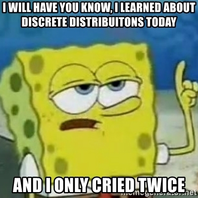

```{r setup, include=FALSE}
library(iblir)
knitr::opts_chunk$set(echo = FALSE)

```

## Introduction

In this lab you will explore The binomial and Poisson distributions.  

## The Binomial Distribution {data-progressive=TRUE}

The binomial distribution is used to describe dichotomous data. The probability density function describes the probability of any particular value being observed in terms of density.  The binomial distribution is a two parameter distribution, which means two values (the number of trials and the probability of success) determine the shape of the distribution. 

### Visualizing Probability density

The data you collect is called binomial when there are only two possible outcomes (YES, NO). The data you collect is approximated by the binomial probability density function (pdf). The pdf function is ${\displaystyle {\binom {n}{x}}p^{x}(1-p)^{n-x}}$ and it describes the probability of any of the possible values (not necessarily observed). R has built in functions for all of the distributions that you will learn about this semester. To learn more check out the [R tutorial page](http://www.r-tutor.com/elementary-statistics/probability-distributions/binomial-distribution)    

### Exercise 1: Binomial Distribution Plot

**Instructions** Run the code below to see the impact different parameter values have on the shape and position of the distributions. Use the plot to answers the quiz questions. 


```{r,ploting_binom, exercise=TRUE }
# Ploting the binomial distribution. 
# number of tials in this case there are 50
trials<-50

# Different probability of success
prob1<-0.5
prob2<-0.3
prob3<-0.8


# Plotting code (you don't have to understand this but feel free to check it out)
# values that probabilities are calculated
X<-seq(0,trials,1)
# This calculates the probabiltiy of success for each value in the x vector
# The propabilities are the y values for our plot 
# This is the distribution for X~BIN(n=50,p=0.5)
Y1<-dbinom(X,trials, prob1)
# This is the distribution for X~BIN(n=50,p=0.3)
Y2<-dbinom(X,trials, prob2)
# This is the distribution for X~BIN(n=50,p=0.8)
Y3<-dbinom(X,trials, prob3)

par(mar=c(5.1, 4.1, 4.1, 8.1), xpd=TRUE)
plot(X,Y1, type = "h", ann=FALSE, col="blue", ylim = c(0,0.12), bty="L")
par(new=T)
plot(X,Y2, type = "h", ann=FALSE, axes=FALSE, col="red")
par(new=T)
plot(X,Y3, type = "h", ann=FALSE, axes=FALSE, col="dark green")
title(main = "Binomial Probability Distributions",
      ylab = "Probability",
      xlab = paste("Number of Successes (Trials = ",paste(trials),")",sep = ""))
legend("topright", title="Probability of Success", c(paste(prob1),paste(prob2),paste(prob3)), fill = c("blue","red","dark green"), cex = 0.75, inset = c(-0.2,0))

```


### Quiz: Questions 1-3

```{r Q1-3}
quiz(
  question("When the probability of success is small what happens to the peak of the distribution?",
    answer("The data is more spread out", message = "The red distribution has the lowest and the green has the highest"),
    answer("It moves away from 0", message = "The red distribution has the lowest and the green has the highest"),
    answer("It moves towards 0", message = "Excellent data interpretation!", correct = TRUE),
    answer("There is no change", message = "The red distribution has the lowest and the green has the highest"),
  allow_retry = TRUE
  ),
  question("Which summary statistic does the peak of the distribution represent?",
    answer("Mean", message = "You are skilled in the ways of the distributions!", correct = TRUE),
    answer("Mode", message = "That is only true for the Poisson distribution"),
    answer("Median", message = "This is only true if the distribution is perfectly symmetrical"),
    answer("Standard Error", message = "This is a measure of variability" ),
  allow_retry = TRUE
  ),
  question("What are the parameters for the green distribution?",
    answer("$Bin(n=50,~p=0.25)$", message = "Remember 'p' is the probability of success and 'n' is the number of trials"),
    answer("$Bin(n=50,~p=0.30)$", message = "Remember 'p' is the probability of success and 'n' is the number of trials"),
    answer("$Bin(n=42,~p=0.80)$", message = "Remember 'p' is the probability of success and 'n' is the number of trials"),
    answer("$Bin(n=50,~p=0.80)$", message = "Excellent work! These two values determine everything about the binomial distribution", correct = TRUE),
  allow_retry = TRUE
  )
)


```


### Exercise 2: Calculating Probabilities from Binomial Distribution 
**Instructions:** Before selecting one of the calculations options move the sliders that change either the probability of success or the number of trials to see how the distribution changes. Then use the one of the appropriate calculation option to answer the quiz questions. (Hint: if you are having a hard time setting specific values with the slider. Click the slider and then use the arrow keys to increase or decrease the value)   

How to calculate the different probabilities: 

* To calculate $P(X<x)$ set the lower bound to $0$ and the upper bound to $x-1$, for example with $Bin(n=50,p=0.5)$ the $P(X<22)=0.161118$ lower bound is set to 0 and the upper bound is set to $21$ ($22-1=21$). 
* To calculate  $P(X\leq x)$ set the lower bound to $0$ and the upper bound to $x$, for example with $Bin(n=50,p=0.5)$ the $P(X\leq22)=0.239944$ lower bound is set to 0 and the upper bound is set to $22$. 
* To calculate $P(X=x)$ set both the lower bound and upper bound to the same value, for example with $Bin(n=50,p=0.5)$ the $P(X=22)=0.078826$ set the lower bound to $22$ and the upper bound to $22$. 
* To calculate $P(x1\leq \ X \leq x2)$ set the lower bound to $x1$ and the upper bound to $x2$, for example with $Bin(n=50,p=0.5)$ the $P(19\leq \ X \leq 22)=0.20749$ set the lower bound to $19$ and the upper bound to $22$.


```{r, contex="render", echo=FALSE }
 
fluidRow(column(6,  sliderInput("n", "Number of Trials", min = 10, 
        max = 1000, value = 50, step = 1)),
        column(6,  sliderInput("p", "Probability of Success", min = 0, 
        max = 1, value = 0.50, step = 0.01)),
       column(3,
           selectInput("selectBC", "Calculations", 
                       choices = list("Calculate Probabilities" = 1, 
                                      "Calculate Percentiles" = 2, 
                                      "None"=3), selected =3)),
        
        
conditionalPanel(condition = "input.selectBC == 1",
                 fluidRow( 
                        tagList(
                          tags$h5("Review the exercise instructions. You can check to see if you are doing it right with the examples."),
                        column(4, numericInput("a", "Lower Bound", min = 0,
                                     max = 1000, value = NA, step = 1)),
                        column(4, numericInput("b", "Upper Bound", min = 0, 
                                     max = 1000, value = NA, step = 1))
                        ))
                 ),


conditionalPanel(condition = "input.selectBC == 2",
        
                 column(6, 
                        tagList(
                          tags$h5("This returns the number of successes for the specified percentile"),
                        numericInput("quantile", "Percentile", min = 0, 
        max = 1, value = NA, step = 0.05)))
                        )
        
        )
        


plotOutput("binplot")


```

```{r, context="server"}

# Code for the function addapted from Bret Larget
# From :http://pages.stat.wisc.edu/~larget/R/prob.R

  gbinom = function(n, p, low=0, high=n,scale = F, a=NA,b=NA,calcProb=!all(is.na(c(a,b))),quantile=NA,calcQuant=!is.na(quantile))
{
  sd = sqrt(n * p * (1 - p))
  if(scale && (n > 10)) {
    low = max(0, round(n * p - 4 * sd))
    high = min(n, round(n * p + 4 * sd))
  }
  values = low:high
  probs = dbinom(values, n, p)
  plot(c(low,high), c(0,max(probs)), type = "n", xlab = "Possible Number of Successes",
       ylab = "Probability",
       main = paste("Binomial Distribution \n", "n =", n, ", p =", p))
  lines(values, probs, type = "h", col = 2)
  abline(h=0,col=3)
  if(calcProb) {
    if(is.na(a))
      a = 0
    if(is.na(b))
      b = n
    if(a > b) {
      d = a
      a = b
      b = d
    }
    a = round(a)
    b = round(b)
    prob = pbinom(b,n,p) - pbinom(a-1,n,p)
    title(paste("P(",a," <= X <= ",b,") = ",round(prob,6),sep=""),line=0,col.main=4)
    u = seq(max(c(a,low)),min(c(b,high)),by=ifelse( max(c(a,low))<min(c(b,high)), 1, -1))
    v = dbinom(u,n,p)
    lines(u,v,type="h",col=4)
  }
  else if(calcQuant==T) {
    if(quantile < 0 || quantile > 1)
      stop("quantile must be between 0 and 1")
    x = qbinom(quantile,n,p)
    title(paste("The ",quantile," percentile = ",x,sep=""),line=0,col.main=4)
    u = 0:x
    v = dbinom(u,n,p)
    lines(u,v,type="h",col=4)
  }
  return(invisible())
  }


output$binplot<-renderPlot({
  
  if(input$selectBC==1){
    gbinom(n=input$n, p=input$p, a=input$a, b=input$b, scale = T)
  }
  
  if(input$selectBC==2){
    gbinom(n=input$n, p=input$p, quantile=input$quantile, scale = T)
  }
  
  if(input$selectBC==3){
  gbinom(n=input$n, p=input$p, scale = F)  
  }
  
})

```


### Quiz: Questions 4-6

**Instructions:** Select "Calculate Probabilities" to answer questions about probability. The "Calculate Percentiles" option will be used in future labs 

**Relevant information for the questions below:**
The prevalence of black lung disease in the general population of coal miners is *p=0.17*. 
```{r Q4-6}
quiz(
  question("What is the probability that 103 or fewer of 600 coal miners will have black lung?",
    answer("0.569316", message = "Exactly right!", correct = TRUE),
    answer("0.473585", message = "Make sure you have the parameters set correctly for the problem."),
    answer("0.64521", message = "Make sure you have the parameters set correctly for the problem."),
    answer("0.05631", message = "Make sure you have the parameters set correctly for the problem."),
  allow_retry = TRUE
  ),
  question("What is the probability that exactly 96 of 600 coal miners will have black lung?",
    answer("0.056210", message = "Make sure you have the parameters set correctly for the problem."),
    answer("0.02064", message = "Make sure you have the parameters set correctly for the problem."),
    answer("0.964238", message = "Make sure you have the parameters set correctly for the problem."),
    answer("0.035762", message = "Great work!", correct = TRUE),
  allow_retry = TRUE
  ),
  question("What is the probability that between 70 to 96 of 600 coal miners will have black lung?",
    answer("0.521003", message = "Make sure you have the parameters set correctly for the problem."),
    answer("0.277488", message = "Your understanding of the binomial distribution is impressive!", correct = TRUE),
    answer("0.364238", message = "Make sure you have the parameters set correctly for the problem."),
    answer("0.235762", message = "Make sure you have the parameters set correctly for the problem."),
  allow_retry = TRUE
  )
)


```


## The Poisson Distribution {data-progressive=TRUE}
The Poisson distribution is used to describe count data over a specific area or time period. The probability density function describes the probability of any particular value being observed in terms of density (also known as probability) .  The Poisson distribution is a one parameter distribution, which means one value lambda ($\lambda$) determines the shape of the distribution. In the case of the Poisson distribution $\lambda$ is both the mean (measure of center), variance (measure of spread), and one of the modes (measure of center). $Lambda$ is often described as a rate (Number of Occurrences/time period), so the birth rate in a hospital could be described as 1.5 per hour. So the distribution shape would be described using the following notation $Pois(\lambda=1.5)$.  

### Visualizing Probability density  
Poisson counts can only be positive integers defined by a time period or specific area. For example the number of parking citations in a month, or the number of parking citations in a month in Athens. The definition of area is not restricted to geographic definitions. The number of parasites on a single honey bee is also a Poisson count with the area being defined as the body of a single honey bee. 

The count data you collect is approximated by the Poisson probability density function (pdf). The pdf function is $P\left( x \right) = \frac{{e^{ - \lambda } \lambda ^x }}{{x!}}$  and it describes the probability of any of the possible values (not necessarily observed). R has built in functions for all of the distributions that you will learn about this semester. 
   

### Exercise 3: Poisson Distribution Plot 

**Instructions** Run the code and look at the impact of different lambda values. 


```{r,ploting_pois, exercise=TRUE }
# Ploting the Poisson distribution. 
# number of occurances in this case there are 150
k<-150

# Different probability of success
lam1<-75
lam2<-140
lam3<-20


# Plotting code (you don't have to understand this but feel free to check it out)
# values that probabilities are calculated for
X<-seq(0,k,1)
# This calculates the probabiltiy of success for each value in the x vector
# The propabilities are the y values for our plot 
# This is the distribution for X~BIN(n=50,p=0.5)
Y1<-dpois(X,lam1)
# This is the distribution for X~BIN(n=50,p=0.3)
Y2<-dpois(X,lam2)
# This is the distribution for X~BIN(n=50,p=0.8)
Y3<-dpois(X,lam3)

par(mar=c(5.1, 4.1, 4.1, 8.1), xpd=TRUE)
plot(X,Y1, type = "h", ann=FALSE, col="blue", ylim = c(0,0.12), bty="L")
par(new=T)
plot(X,Y2, type = "h", ann=FALSE, axes=FALSE, col="red")
par(new=T)
plot(X,Y3, type = "h", ann=FALSE, axes=FALSE, col="dark green")
title(main = "Poisson Probability Distributions",
      ylab = "Probability",
      xlab = paste("Number of Occurrences (k = ",paste(k),")",sep = ""))
legend("topright", title=expression(paste(lambda,"Values")), c(paste(lam1),paste(lam2),paste(lam3)), fill = c("blue","red","dark green"), cex = 0.75, inset = c(-0.2,0))


```


### Quiz: Questions 7-9

```{r Q7-9}
quiz(
  question("When $\\lambda$ is small what happens to the peak of the distribution? (select all that apply)",
    answer("The data is less spread out", message = "You are doing great!", correct = TRUE),
    answer("It moves away from 0", message ="Make sure you read the plot key carefully"),
    answer("It moves towards 0", message = "You are a natural!", correct = TRUE),
    answer("There is no change", message ="Make sure you read the plot key carefully"),
  allow_retry = TRUE
  ),
  question("Which summary statistics do the peaks of the distribution represent? (select all that apply)",
    answer("Mean", message = "Your understanding of Poisson distribution is remarkable.", correct = TRUE),
    answer("One of the Modes", message = "Keep up the good work!", correct = TRUE),
    answer("Median", message = "Actually the median $\\approx\\lfloor\\lambda+{1}/{3}-{0.02}/{\\lambda\\rfloor}$ ($\\lfloor this~means~round~down \\rfloor$)"),
    answer("Standard Error", message = "This is a measure of variability"),
  allow_retry = TRUE
  ),
  question("What notation describes the blue distribution?",
    answer("$Pois(\\lambda=140)$", message ="Make sure you read the plot key carefully"),
    answer("$Pois(\\lambda=75)$", message = "One number to control it all", correct = TRUE),
    answer("$Pois(\\lambda=42)$", message ="Make sure you read the plot key carefully"),
    answer("$Pois(\\lambda=20)$", message ="Make sure you read the plot key carefully"),
  allow_retry = TRUE
  )
)

```


### Exercise 4: Calculating Probabilities from Poisson Distribution 

**Instructions:** Before selecting one of the calculations options move the slider that changes lambda ($\lambda$) to see how the distribution changes. Then use the appropriate calculation option to answer the quiz questions. (Hint: if you are having a hard time setting specific values with the slider. Click the slider and then use the arrow keys to increase or decrease the value)  

How to calculate the different probabilities: 

* To calculate $P(X<x)$ set the lower bound to $0$ and the upper bound to $x-1$, for example with $Pois(\lambda=1.5)$ the $P(X<2)=0.557825$ lower bound is set to $0$ and the upper bound is set to $1$ ($2-1=1$). 
* To calculate  $P(X\leq x)$ set the lower bound to $0$ and the upper bound to $x$, for example with $Pois(\lambda=1.5)$ the $P(X\leq2)=0.808847$ lower bound is set to $0$ and the upper bound is set to $2$. 
* To calculate $P(X=x)$ set both the lower bound and upper bound to the same value, for example with $Pois(\lambda=1.5)$ the $P(X=2)=0.251021$ set the lower bound to $2$ and the upper bound to $2$. 
* To calculate $P(x1\leq \ X \leq x2)$ set the lower bound to $x1$ and the upper bound to $x2$, for example with $Pois(\lambda=1.5)$ the $P(1\leq \ X \leq 2)=0.585717$ set the lower bound to $1$ and the upper bound to $2$.

```{r, contex="render", echo=FALSE }

 

fluidRow(
         column(12, sliderInput("mu", label= "Specify lambda:", min = 0, 
                                 max = 20, value = 1.5, step = 0.01)),
         column(3, selectInput("selectPC", "Calculations", 
                               choices = list("Calculate Probabilities" = 1, 
                                              "Calculate Percentiles" = 2, 
                                              "None"=3), selected =3)),
        
        
conditionalPanel(condition = "input.selectPC == 1",
                 fluidRow( 
                        tagList(
                          tags$h5("Review the exercise instructions. You can check to see if you are doing it right with the examples."),
                        column(4, numericInput("aP", "Lower Bound", min = 0,
                                     max = 1000, value = NA, step = 1)),
                        column(4, numericInput("bP", "Upper Bound", min = 0, 
                                     max = 1000, value = NA, step = 1))
                        ))
                 ),


conditionalPanel(condition = "input.selectPC == 2",
        
                 column(6, 
                        tagList(
                          tags$h5("This returns the number of successes for the specified percentile"),
                        numericInput("quantileP", "Percentile", min = 0, 
        max = 1, value = NA, step = 0.05)))
                        )
        
        )

plotOutput("poisplot")


```


```{r, context="server"}

# Code for the function addapted from Bret Larget
# From :http://pages.stat.wisc.edu/~larget/R/prob.R

  gpois = function(mu, a=NA,b=NA,calcProb=(!is.na(a) | !is.na(b)),quantileP=NA,calcQuant=!is.na(quantileP))
{
  sd = sqrt(mu)
  low = max(0, round(mu - 3 * sd))
  high = round(mu + 5 * sd)
  values = low:high
  probs = dpois(values, mu)
  plot(c(low,high), c(0,max(probs)), type = "n", xlab = "observable values",
       ylab = "Probability",
       main =substitute(paste("Poisson Distribution with ",lambda==m), list(m=mu)))
  lines(values, probs, type = "h", col = 2)
  abline(h=0,col=3)
  if(calcProb) {
    if(is.na(a)){ a = 0 }
    if(is.na(b)){
      a = round(a)
      prob = 1-ppois(a-1,mu)
      title(paste("P(",a," <= Y ) = ",round(prob,6),sep=""),line=0,col.main=4)
      u = seq(max(c(a,low)),high,by=ifelse(max(c(a,low))<high, 1, -1))
    }
    else {
      if(a > b) {d = a; a = b; b = d;}
      a = round(a); b = round(b)
      prob = ppois(b,mu) - ppois(a-1,mu)
      title(paste("P(",a," <= X <= ",b,") = ",round(prob,6),sep=""),line=0,col.main=4)
      u = seq(max(c(a,low)),min(c(b,high)),by=ifelse(max(c(a,low))<min(c(b,high)), 1, -1))
    }
    v = dpois(u,mu)
    lines(u,v,type="h",col=4)
  }
  else if(calcQuant==T) {
    if(quantileP < 0 || quantileP > 1)
      stop("Percentile must be between 0 and 1")
    x = qpois(quantileP,mu)
    title(paste("The ",quantileP," percentile = ",x,sep=""),line=0,col.main=4)
    u = 0:x
    v = dpois(u,mu)
    lines(u,v,type="h",col=4)
  }
  return(invisible())
}


output$poisplot<-renderPlot({
  
  if(input$selectPC==1){
    gpois(mu=input$mu, a=input$aP, b=input$bP)
  }
  
  if(input$selectPC==2){
    gpois(mu=input$mu, quantile=input$quantileP)
  }
  
  if(input$selectPC==3){
  gpois(mu=input$mu)  
  }
  
})

```


### Quiz: Questions 10-12

**Instructions:** Select "Calculate Probabilities" to answer questions about probability. The "Calculate Percentiles" option will be used in future labs 

**Relevant information for the questions below:**
The average rate of car accidents in Athens is 2.6 per day. 
```{r Q10-12}
quiz(
  question("What is the probability that 1 or fewer car accidents occur in a day?",
    answer("0.326916", message = "Make sure you have the parameters set correctly for the problem."),
    answer("0.074274", message = "Make sure you have the parameters set correctly for the problem."),
    answer("0.264521", message = "Make sure you have the parameters set correctly for the problem."),
    answer("0.267385", message = "Calculating probabilities like a boss", correct = TRUE),
  allow_retry = TRUE
  ),
  question("What is the probability that exactly 4 car accidents occur in a day?",
    answer("0.156210", message = "Make sure you have the parameters set correctly for the problem."),
    answer("0.102064", message = "Make sure you have the parameters set correctly for the problem."),
    answer("0.141422", message = "Nailed it!", correct = TRUE),
    answer("0.135762", message = "Make sure you have the parameters set correctly for the problem."),
  allow_retry = TRUE
  ),
  question("What is the probability that between 4 to 6 car accidents occur in a day?",
    answer("0.251303", message = "Make sure you have the parameters set correctly for the problem."),
    answer("0.246828", message = "You are right!", correct = TRUE),
    answer("0.342638", message = "Make sure you have the parameters set correctly for the problem."),
    answer("0.723562", message = "Make sure you have the parameters set correctly for the problem."),
  allow_retry = TRUE
  )
)

```


## Summary

In this lab, you completed 4 exercises and answered 12 quiz questions. 

The lab covered 2 topics:

1. The Binomial Distribution
2. The Poisson Distribution

You are done with lab now you can binge a new show on Netflix! **Don't forget to record your answers and take the eLC quiz to get credit**


```{r joke, fig.cap="from: https://www.empr.com/slideshow/slides/cartoons-3-10-2013/ "}



```


