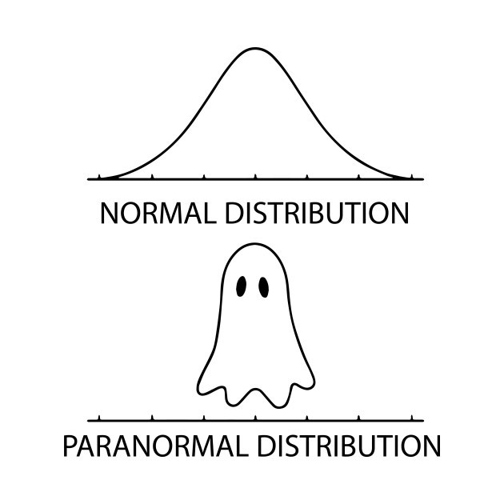

```{r setup, include=FALSE}
library(iblir)
knitr::opts_chunk$set(echo = FALSE)
```


## Introduction

In this lab you will explore the normal distribution. 

## Normal distribution {data-progressive=TRUE}

The normal distribution is used to describe continuous data. It is a two parameter distribution defined by the mean ($\mu$) and standard deviation ($\sigma$). Every aspect of the curve is described using the following notation ($N(\mu,~\sigma)$) where the mean ($\mu$) can be any real number and the standard deviation ($\sigma$) any value greater then 0. In the exercise you will get to see the impact the mean and standard deviation have on the shape of the distribution curve. Also unlike the last lab the normal distribution is visualized with a line instead of vertical lines. This is because unlike the discrete distributions values between the integers are possible. 

### Exercise 1: Visualizing the normal distribution

**Instructions** The plot below shows three normal curves. Use the sliders to change the means and standard deviations to see the impact it has on the shape and position of the curve. Once you get a feel for whats happening, use the interactive plot to answer the quiz question. (You will have to adjust the X axis range if the mean is set far away from 0)


```{r, contex="render", echo=FALSE}


fluidPage(
  fluidRow(
    column(12,
      fluidRow(
        column(4,
          h5(strong("Parameters for The", span("Green",style="color:darkgreen"), "Distribution")),
          wellPanel(
            fluidRow(
              column(12,
                     sliderInput("mean1", "Green Mean:",
                               min = -100, max = 100, value = 0, step = 0.5)),
              column(12,
                     sliderInput("sd1", "Green Standard Deviation:", 
                               min = 0, max = 20, value = 1, step = 0.5))
              )
            )
          ),
        column(4,
          h5(strong("Parameters for The", span("Blue",style="color:blue"), "Distribution")),
          wellPanel(
            fluidRow(
              column(12, 
                     sliderInput("mean2", "Blue Mean:", 
                                 min = -100, max = 100, value = 0, step = 0.5)),
              column(12,
                     sliderInput("sd2", "Blue Standard Deviation:", 
                                 min = 0, max = 20, value = 3, step = 0.5))
              )
            )
          ),
        column(4,
          h5(strong("Parameters for The", span("Red",style="color:red"), "Distribution")),
          wellPanel(
            fluidRow(
              column(12,
                     sliderInput("mean3", "Red Mean:",
                               min = -100, max = 100, value = 0, step = 0.5)),
              column(12,
                     sliderInput("sd3", "Red Standard Deviation:",
                                 min = 0, max = 20, value = 5, step = 0.5))
              )
            )
          )
        )
      )
    )
  )


fluidPage(
  fluidRow(
    column(12,
           wellPanel(
             fluidRow(
               column(12, 
                      sliderInput("Xaxis", "Set limits of X axis:", 
                                  min = -175, max = 175, value = c(-15,15), sep ="")
                      )
               )
             )
           )
    )
  )


plotOutput("normplot")

```


```{r, context="server"}
## Code adapted from: 
# https://steemit.com/programming/@dkmathstats/plotting-probability-distribution-functions-in-r-using-ggplot2

# Multiple Normal Distributions:

output$normplot<-renderPlot({

  # X axis values
  Xlow <- input$Xaxis[1]
  Xup <- input$Xaxis[2]

ggplot(data.frame(x = c(Xlow , Xup)), aes(x = x)) + 
  xlim(c(Xlow , Xup)) + 
  stat_function(fun = dnorm, args = list(mean = input$mean1, sd = input$sd1), size=1.15, 
                aes(color = "Curve1")) + 
  
  stat_function(fun = dnorm, args = list(mean = input$mean2, sd = input$sd2), size=1.15,
                aes(color = "Curve2")) + 
  
  stat_function(fun = dnorm, args = list(mean = input$mean3, sd = input$sd3), size=1.15,
                aes(color = "Curve3")) + 
  
  scale_color_manual(values = c("Curve1"="darkgreen", "Curve2"="blue", "Curve3"="red"),
                     labels=c("Curve1"=substitute(paste("N(",mu," = ", m1,", ", 
                                                        sigma," = ",s1,")"),
                                                  list(m1=input$mean1, s1=input$sd1)), 
                              "Curve2"=substitute(paste("N(",mu," = ", m2,", ", 
                                                        sigma," = ",s2,")"),
                                                  list(m2=input$mean2, s2=input$sd2)), 
                              "Curve3"=substitute(paste("N(",mu," = ", m3,", ", 
                                                        sigma," = ",s3,")"),
                                                  list(m3=input$mean3, s3=input$sd3)))) +
  
  labs(x = "\n Possible Values", y = "Probability \n", 
       color="Distribution Parameters") + 
  theme(axis.title.x = element_text(face="bold", colour="black", size = 12),
        axis.title.y = element_text(face="bold", colour="black", size = 12),
        legend.title = element_text(face="bold", size = 14),
        legend.text = element_text(size=14),
        legend.key = element_rect(fill = "white", size = 1.25),
        legend.position = "bottom",
        panel.background = element_rect(fill = "white", color = "black"),
        panel.grid.major = element_blank(),
        panel.grid.minor = element_blank())

  
})


```

### Quiz: Questions 1-4

```{r Q1-4}
quiz(
  question("What happens as the standard deviation ($\\sigma$) increases?",
    answer("The curve gets narrower and the peak gets higher"),
    answer("The curve moves to the right of the plot"),
    answer("The curve spreads out and the peak gets lower", correct = TRUE),
    answer("The curve moves to the left of the plot"),
  allow_retry = TRUE
  ),
    question("What happens as the mean ($\\mu$) decreases?",
    answer("The curve gets narrower and the peak gets higher"),
    answer("The curve moves to the right of the plot"),
    answer("The curve spreads out and the peak gets lower"),
    answer("The curve moves to the left of the plot", correct = TRUE),
  allow_retry = TRUE
  ),
    question("What happens as the standard deviation ($\\sigma$) decreases?",
    answer("The curve gets narrower and the peak gets higher", correct = TRUE),
    answer("The curve moves to the right of the plot"),
    answer("The curve spreads out and the peak gets lower"),
    answer("The curve moves to the left of the plot"),
  allow_retry = TRUE
  ),
  question("What parameters define the Standard Normal curve?",
    answer("$N(\\mu=1,~\\sigma=0)$"),
    answer("$N(\\mu=42,~\\sigma=42)$"),
    answer("$N(\\mu=14,~\\sigma=6)$"),
    answer("$N(\\mu=0,~\\sigma=1)$", correct = TRUE),
  allow_retry = TRUE
  )
)
```


## Normal probability density function {data-progressive=TRUE}

There are an endless number of possible curves, but the one we will discuss the most in class is the "standard normal". The standard normal distribution has a mean of 0 and a standard deviation of 1 ($N(\mu=0,~\sigma=1)$). The equation for the general pdf for a normal distribution is a little intimidating, but since the standard normal distribution is the simplest case the pdf simplifies to $P(x) = \frac{1}{{\sqrt {2\pi } }}e^{ - \frac{{1}}{2}x^2}$. With modern computers and calculators the need to use the simplest case is not a major concern. In the exercise below you will use an interactive graph to find probabilities. The graph shades the area under the curve associated with the probability in red. The probability is shown on the plot in blue text.     


### Exercise 2: Calculating Probabilities

**Instructions:** The graph doesn't seem to change but pay attention to the x axis as you change the mean or standard deviation. To answer the quiz questions select "Calculate Probability" from the drop down menu.

How to calculate the different probabilities: 

* To calculate $P(X<x)$ set the **upper** bound to $x$. 
    + For example with $N(\mu=150,\sigma=15)$ the $P(X<120)=0.0228$ set the upper bound is set to $120$ (The compliment probability is also shown).  
* To calculate $P(X>x)$ set the **lower** bound to $x$.
    + For example with $N(\mu=150,\sigma=15)$ the $P(X>120)=0.0228$ set the lower bound is set to $120$ (The compliment probability is also shown).  
* To calculate $P(x1 < X < x2)$ set the lower bound to $x1$ and the upper bound to $x2$.
    + For example with $N(\mu=150,\sigma=15)$ the $P(120 < X < 140)=0.2297$ set the lower bound to $120$ and the upper bound to $140$.  

```{r, context="render", echo=FALSE}

fluidPage(
  fluidRow(
    column(12,
           h3("Set the Distribution Parameters"),
           wellPanel(
             fluidRow(
               column(6,
                      numericInput("mu", "Specify the Mean (mu):", 
                                   value = 0, step = 0.01,
                                   width = 1000)
                    ),
               column(6,
                      numericInput("sigma", "Specify the Standard Deviation (sigma):", 
                                   value = 1, step = 0.01,
                                   width = 1000)
                      )
               )
             )
           )
    )
  )


fluidPage(
  fluidRow(
    column(12,
           wellPanel(
             fluidRow(
               column(4,
                      selectInput("select", "Select Calculation Type", 
                                 choices = list("Calculate Probabilities" = 1, 
                                                "Calculate Percentiles" = 2, 
                                                "None"=3), selected =3)
                      ),
               column(8,
                      conditionalPanel(condition = "input.select == 1",
                                       fluidRow(
                                         tagList(
                                         tags$h4("Set the lower and upper bound for the probability you want to calculate.
                                                 You can check if you are doing it right using the example solutions in the instructions."),
                                         column(6, numericInput("a", "Lower Bound", 
                                                                value = NA, step = 1)
                                                ),
                                         column(6, numericInput("b", "Upper Bound", 
                                                                value = NA, step = 1)
                                                )
                                         )
                                         )
                                       )
                      ),
               column(8,
                      conditionalPanel(condition = "input.select == 2",
                                       column(8, 
                                              tagList(
                                                tags$h4("This returns the value for the specified percentile."),
                                                numericInput("quantile", "Set the Percentile (0 < Values < 1)", 
                                                             value = NA, step = 0.05)
                                                )
                                              )
                                       )
                      )
               )
             )
           )
    )
  )


plotOutput("normplot1")
  

```


```{r, context="server"}
gnorm = function(mu, sigma,a=NA,b=NA,calcProb=!all(is.na(c(a,b))),quantile=NA,calcQuant=!is.na(quantile))
{
  values = seq(-1,1,.005) * 4 * sigma + mu
  probs = dnorm(values, mu, sigma)
  plot(values, probs, axes = F, type = "n", xlab = "Possible Values", 
       ylab = "Probability Density",
       main = substitute(paste("Normal Distribution with X~N( ",mu == m,", ",sigma == s," )"),list(m=mu,s=sigma)), cex.main=1.5)
  axis(1, pos = 0)
  abline(0,0,col=1)
  lines(values, probs, col = 2)
  lo = mu - 4 * sigma
  hi = mu + 4 * sigma
  h = dnorm(mu,mu,sigma)
  cex=1.25
  if(calcProb==T)
  {
    if(!is.na(a) && !is.na(b) && a > b){
      d = a; a = b; b = d
    }
    if(is.na(a) || a <= lo){ ulo = lo }
    else if(a <= hi){ ulo = a }
    else { ulo = hi }
    if(is.na(b) || b >= hi){ uhi = hi }
    else if(b >= lo){ uhi = b }
    else { uhi = lo }
    u = seq(ulo,uhi,length=601)
    lines(u,dnorm(u,mu,sigma),type="h",col=2)
    if(!is.na(a) && !is.na(b)){
      text(mu - 3.9 * sigma, 0.8 * h,
           paste("P( ",a," < X < ",b," ) = ",
                 round(pnorm(b,mu,sigma)-pnorm(a,mu,sigma),digits=4),sep=""),
           adj=0,col=4,cex=cex)
      text(mu - 3.9 * sigma, 0.6 * h,
           paste("P( X < ",a," ) = ",
                 round(pnorm(a,mu,sigma),digits=4),sep=""),adj=0,col=4,cex=cex)
      text(mu + 3.9 * sigma, 0.5 * h,
           paste("P( X > ",b," ) = ",
                 round(1-pnorm(b,mu,sigma),digits=4),sep=""),adj=1,col=4,cex=cex)
    }
    else if(!is.na(a) && is.na(b)){
      text(mu - 3.9 * sigma, 0.6 * h,
           paste("P( X < ",a," ) = ",
                 round(pnorm(a,mu,sigma),digits=4),sep=""),adj=0,col=4,cex=cex)
      text(mu + 3.9 * sigma, 0.5 * h,
           paste("P( X > ",a," ) = ",
                 round(1-pnorm(a,mu,sigma),digits=4),sep=""),adj=1,col=4,cex=cex)
    }
    else if(is.na(a) && !is.na(b)){
      text(mu - 3.9 * sigma, 0.6 * h,
           paste("P( X < ",b," ) = ",
                 round(pnorm(b,mu,sigma),digits=4),sep=""),adj=0,col=4,cex=cex)
      text(mu + 3.9 * sigma, 0.5 * h,
           paste("P( X > ",b," ) = ",
                 round(1-pnorm(b,mu,sigma),digits=4),sep=""),adj=1,col=4,cex=cex)
    }
  }
  else if(calcQuant==T)
  {
    zoffseth = 0.05
    if( quantile <= 0 || quantile >= 1) quantile = 0.5
    x = qnorm(quantile,mu,sigma)
    if( x > lo && x < hi - 0.5 )
    {
      u = seq(lo,x,length=601)
      lines(u,dnorm(u,mu,sigma),type="h",col=2)
      text(x, zoffseth * h,
           paste("z = ",round(qnorm(quantile),2),sep=""),adj=1,col=4,cex=cex, pos = 4)
    }
    else if(x >= hi - 0.5)
    {
      u = seq(lo,hi,length=601)
      lines(u,dnorm(u,mu,sigma),type="h",col=2)
      text(hi, zoffseth * h,
           paste("z = ",round(qnorm(quantile),2),sep=""),adj=0.5,col=4,cex=cex)
    }
    else if( x <= lo)
    {
      text(lo, zoffseth * h,
           paste("z = ",round(qnorm(quantile),2),sep=""),adj=0,col=4,cex=cex)
    }
    text(mu - 3.9 * sigma, 0.5 * h,
         paste("P( X < ",signif(x,4)," ) = ",
               round(quantile,digits=4),sep=""),adj=0,col=4,cex=cex)
  }
  return(invisible())
}


# function is given different input depending on the type of plot. 

output$normplot1<-renderPlot({
  
  validate(need(!is.na(input$mu), 'Please provide a mean for the distribution'),
           need(!is.na(input$sigma), 'Please provide a standard deviation for the distribution'),
           need(!(input$sigma<=0), 'Please provide a standard deviation that is not less than or equal to 0'))
  
  
  if(input$select==1){
    gnorm(mu=input$mu, sigma=input$sigma, a=input$a, b=input$b)
  }
  
  if(input$select==2){
    
    if (!is.na(input$quantile)){
    validate(need(!(input$quantile >= 1), 'Percentiles greater than or equal to 1 are not possible.'),
             need(!(input$quantile <= 0), 'Percentiles  less than or equal to 0 are not possible.'))  
    }
    
     gnorm(mu=input$mu, sigma=input$sigma, quantile=input$quantile) 
    
  }
  
  if(input$select==3){
    gnorm(mu=input$mu, sigma=input$sigma)  
  }
  
})

```

### Quiz: Questions 5-8

**Scenario 1:** A ski gondola in Vail, Colorado carries skiers to the top of a mountain.  It bears a plaque stating that the maximum capacity is 12 people or 2004 pounds.  That capacity will be exceeded if 12 people have weights with a mean greater than $\frac{2004}{12}=167lbs$.  Because men tend to weigh more than women, a “worst case” scenario involved 12 passengers who are all men. Men have weights that are normally distributed with a mean of 172 lbs and a standard deviation of 29 lbs.

**Scenario 2:** Weights of newborn babies in the U.S. are normally distributed with a mean of 3420g and a standard deviation of 495g.  A newborn weighing less than 2200g is considered to be at risk. 

**Scenario 3:** It was found that the mean length of 100 parts produced by a lathe was 20.05 mm with a standard deviation of 0.2mm.
```{r Q5-8}
quiz(
  question("What is the probability that a randomly selected man's weight will be greater than 167lbs? (Use Scenario 1 Information)",
    answer("0.4242"),
    answer("0.5421"),
    answer("0.4316"),
    answer("0.5684", correct = TRUE),
  allow_retry = TRUE
  ),
  
  question("If all 12 people on the gondola are men is it likely over loaded? (Use Scenario 1 Information)",
    answer("Yes, because kids are allowed"),
    answer("No, there is no way to know"),
    answer("Yes, It is more probable that at man has a weight greater than 167lbs", correct = TRUE),
    answer("No, The plaque is just there to scare people"),
  allow_retry = TRUE
  ),
  
  question("What proportion of newborn babies are in the “at-risk” category? (Use Scenario 2 Information)",
    answer("0.0069", correct = TRUE),
    answer("0.9931"),
    answer("0.4020"),
    answer("0.0684"),
  allow_retry = TRUE
  ),
  
  question("What is the probability that a part selected at random would have a length less than 19.75mm? (Use Scenario 3 Information)",
    answer("0.0242"),
    answer("0.9772"),
    answer("0.0668", correct = TRUE),
    answer("0.0031"),
  allow_retry = TRUE
  )
)
```

## Inverse normal probability function {data-progressive=TRUE}

Finding the probability of randomly selecting a value from a distribution is pretty fun, but sometimes we want to know the value associated with a certain probability. For example among the how tall does a person have to be to be taller than 90% of other people. To find that value we do the inverse of what we did to calculate a probability. Instead of specifying a lower or upper bound we specify a probability (percentile) and find the value that corresponds. 

### Exercise 3: Using the inverse probability function

**Instructions** To answer the quiz questions select "Calculate Percentiles" from the drop down menu. (Hint: if you are having a hard time setting specific values with the slider. Click the slider and then use the arrow keys to increase or decrease the value)

Finding the $x$ values that correspond to percentiles: 

* To to find $x$ such that $P(X<x)=0.25$ set the percentile to $0.25$. 
    + For example with $N(\mu=0,~\sigma=1)$ the $x$ such that $P(X<x)=0.25$ is $-0.6745$.

```{r, context="render", echo=FALSE}

fluidPage(
  fluidRow(
    column(12,
           h3("Set the Distribution Parameters"),
           wellPanel(
             fluidRow(
               column(6,
                      numericInput("mu1", "Specify the Mean (mu):", 
                                   value = 0, step = 0.01,
                                   width = 1000)
                    ),
               column(6,
                      numericInput("sigma1", "Specify the Standard Deviation (sigma):", 
                                   value = 1, step = 0.01,
                                   width = 1000)
                      )
               )
             )
           )
    )
  )


fluidPage(
  fluidRow(
    column(12,
           wellPanel(
             fluidRow(
               column(4,
                      selectInput("select1", "Select Calculation Type", 
                                 choices = list("Calculate Probabilities" = 1, 
                                                "Calculate Percentiles" = 2, 
                                                "None"=3), selected =3)
                      ),
               column(8,
                      conditionalPanel(condition = "input.select1 == 1",
                                       fluidRow(
                                         tagList(
                                         tags$h4("Set the lower and upper bound for the probability you want to calculate.
                                                 You can check if you are doing it right using the example solutions in the instructions."),
                                         column(6, numericInput("a1", "Lower Bound", 
                                                                value = NA, step = 1)
                                                ),
                                         column(6, numericInput("b1", "Upper Bound", 
                                                                value = NA, step = 1)
                                                )
                                         )
                                         )
                                       )
                      ),
               column(8,
                      conditionalPanel(condition = "input.select1 == 2",
                                       column(8, 
                                              tagList(
                                                tags$h4("This returns the value for the specified percentile."),
                                                numericInput("quantile1", "Set the Percentile (0 < Values < 1)", 
                                                             value = NA, step = 0.05)
                                                )
                                              )
                                       )
                      )
               )
             )
           )
    )
  )


plotOutput("normplot2")
  

```

```{r, context="server"}

# function is given different input depending on the type of plot. 

output$normplot2<-renderPlot({
  
  validate(need(!is.na(input$mu1), 'Please provide a mean for the distribution'),
           need(!is.na(input$sigma1), 'Please provide a standard deviation for the distribution'),
           need(!(input$sigma1<=0), 'Please provide a standard deviation that is not less than or equal to 0'))
  
  if(input$select1==1){
    gnorm(mu=input$mu1, sigma=input$sigma1, a=input$a1, b=input$b1)
  }
  
  if(input$select1==2){
    
    if (!is.na(input$quantile1)){
    validate(need(!(input$quantile1 >= 1), 'Percentiles greater than or equal to 1 are not possible.'),
             need(!(input$quantile1 <= 0), 'Percentiles  less than or equal to 0 are not possible.'))  
    }
    
     gnorm(mu=input$mu1, sigma=input$sigma1, quantile=input$quantile1) 
    
  }
  
  if(input$select1==3){
    gnorm(mu=input$mu1, sigma=input$sigma1)  
  }
  
})

```


### Quiz: Questions 9-11

**Scenario 1:** A ski gondola in Vail, Colorado carries skiers to the top of a mountain.  It bears a plaque stating that the maximum capacity is 12 people or 2004 pounds.  That capacity will be exceeded if 12 people have weights with a mean greater than $\frac{2004}{12}=167lbs$.  Because men tend to weigh more than women, a “worst case” scenario involved 12 passengers who are all men. Men have weights that are normally distributed with a mean of 172 lbs and a standard deviation of 29 lbs.

**Scenario 2:** Weights of newborn babies in the U.S. are normally distributed with a mean of 3420g and a standard deviation of 495g.  A newborn weighing less than 2200g is considered to be at risk. 

**Scenario 3:** It was found that the mean length of 100 parts produced by a lathe was 20.05 mm with a standard deviation of 0.2mm.
```{r Q9-11}
quiz(
  question("The heaviest 10% of men weigh more than what amount? (Use Scenario 1 Information)",
    answer("172.0 lbs"),
    answer("134.8 lbs"),
    answer("209.2 lbs", correct = TRUE),
    answer("1.28 lbs"),
  allow_retry = TRUE
  ),
  
  question("What is the weight of a baby in the 20th percentile? (Use Scenario 2 Information)",
    answer("4242 g"),
    answer("3837 g"),
    answer("2020 g"),
    answer("3003 g", correct = TRUE),
  allow_retry = TRUE
  ),
  
  question("99% of the parts are shorter than what length? (Use Scenario 3 Information)",
    answer("20.52 mm", correct = TRUE),
    answer("19.58 mm"),
    answer("20.07 mm"),
    answer("19.82 mm"),
  allow_retry = TRUE
  )
)
```


## Summary

In this lab, you completed 3 exercises and answered 11 quiz questions. 

The lab covered 3 topics:

1. The normal distribution 
2. Normal probability function
3. Inverse normal probability function


You are done with lab! Don't worry if you are sad it is over you can always review one of the previous labs! **Don't forget to record your answers and take the eLC quiz to get credit**


```{r joke, fig.cap="from: https://towardsdatascience.com/what-if-your-data-is-not-normal-d7293f7b8f0 "}



```


